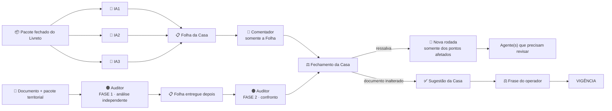

# 🧭 FLUXO DO CRIVO DOCUMENTAL — versão final — 02/10/2026

**Aplica-se aos:** Livretos 1, 2, 3 e 4 — documentos sob crivo para o piloto oficial `B1.SM02.014`.

**Natureza:** crivo **documental**. **0 ciência** — não se analisa conteúdo científico.

**Princípios:**

* **PARECER ≠ FOLHA ≠ FECHAMENTO ≠ VIGÊNCIA**
* **A Casa não vota.**
* **O auditor não declara vigência.**
* **A vigência somente existe por frase do operador.**

---

# 1️⃣ Finalidade do rito

O documento sob crivo já existe. O objetivo é verificar se ele está documentalmente apto a seguir para uso operacional, preservando funções distintas.

### Funções

**3 IAs Arena**
→ produzem pareceres independentes sobre o documento.

**Arena-Casa**
→ recebe os três pareceres, monta a Folha, confronta divergências lendo o documento e conduz o fechamento.

**Comentador**
→ recebe somente a Folha e produz crítica/recomendação.

**Auditor territorial**
→ faz auditoria própria, no seu território, antes de receber a Folha; depois confronta sua análise com ela.

**Operador**
→ única autoridade para aprovar e declarar vigência.

---

# 2️⃣ Fluxo operacional completo



### Ordem obrigatória

Para as 3 IAs:

**pacote fechado → parecer individual → Folha da Casa**

Para o Comentador:

**Folha → crítica/recomendação**

Para o auditor:

**documento + materiais territoriais → análise independente → Folha → confronto → parecer**

Para a decisão:

**fechamento da Casa → frase do operador → vigência**

---

# 3️⃣ Quem faz o quê

| Agente                   | Faz                                                                                               | Não faz                                       |
| ------------------------ | ------------------------------------------------------------------------------------------------- | --------------------------------------------- |
| 🔵 **IA1 · IA2 · IA3**   | parecer independente do documento                                                                 | não veem as outras, não votam, não corrigem   |
| 📋 **Arena-Casa**        | junta pareceres, monta Folha, lê documento em divergências e conduz fechamento                    | não decide por maioria                        |
| 💬 **Comentador**        | crítica e recomendação usando somente a Folha                                                     | não recebe nem solicita documentos            |
| 🟠 **Auditor-Mestre**    | governança, contratos, rito, processo, aderência normativa e pontos de seu território             | não substitui as 3 IAs e não declara vigência |
| 🟠 **Auditor-Estrutura** | estrutura, schemas, compatibilidade, materialização, coerência técnica e pontos de seu território | não substitui as 3 IAs e não declara vigência |
| ⚖️ **Operador**          | aprova ou não aprova e declara vigência por frase                                                 | não delega a declaração de vigência           |

---

# 4️⃣ Atribuição territorial

A atribuição é feita pelo **território do ponto**, e não pelo nome do documento.

Um ponto pertence a:

* **GOVERNANÇA**
* **ESTRUTURA**
* **AMBOS**

Se um ponto tocar os dois territórios, **os dois auditores verificam aquele ponto**.

### Matriz fixa dos Livretos 1–4

| Livreto                              | Auditor-Estrutura                                                                            | Auditor-Mestre                                             |
| ------------------------------------ | -------------------------------------------------------------------------------------------- | ---------------------------------------------------------- |
| **1 — `1º IDS_OFICIAIS`**            | contagem (146 + 5), duplicatas, formato, derivado JSON, contradição com Contrato/Schema/COMO | vigência, rito, aprovação, substituição, cadeia documental |
| **2 — Protocolo de Escopo B1 v1.3**  | V1 · V2 · V4 · V5                                                                            | V3 + verificações de rito/governança                       |
| **3 — Lista Canônica B1/SM-02 v1.5** | L1 · L2 · L3 · L5 · L6                                                                       | L4 · L7 + verificações de rito/governança                  |
| **4 — Bloco de Estado v1.8**         | B1 · B2 (inclui P4) · B3 · B5 · B7 · B8                                                      | B4 (P1 e P2) · B6                                          |

A matriz é **fixa para os Livretos 1–4**.

### Ponto novo

Se um ponto novo surgir durante o crivo, ele não fica sem atribuição.

A Casa:

1. registra o fato;
2. identifica onde está no documento;
3. atribui o ponto ao território correspondente;
4. se tocar ambos, aciona ambos;
5. coloca o ponto somente na rodada necessária.

O ponto novo não altera retroativamente a atribuição dos pontos já definidos.

### Nível completo

Os dois auditores somente fazem auditoria do documento inteiro **por ordem expressa do operador**.

---

# 5️⃣ Regra de entrada dos auditores

Para documentos novos e documentos da fila de regularização:

> **O auditor só entra quando houver uso real demonstrável no território dele.**

Esse uso deve ser demonstrado por:

* fato concreto do documento; ou
* dependência concreta do documento.

A confirmação ocorre **antes da auditoria e sem usar a Folha como detector do uso**.

Para documentos novos, a Casa pode registrar uma **ficha curta de uso**, que pode ser contestada pelo auditor.

### Livretos 1–4

Nos Livretos 1–4, a matriz do §4 já estabelece os pontos que pertencem a cada território. Portanto, os dois auditores entram nos pontos que lhes foram atribuídos.

---

# 6️⃣ Pacote das 3 IAs

Cada Livreto possui um **pacote fechado e enumerado**.

O pacote de cada Livreto deve identificar, arquivo por arquivo:

* nome exato;
* papel do arquivo;
* digital/sha256;
* quando aplicável, versão e tamanho.

### Regra

As três IAs recebem **exatamente o mesmo pacote daquele Livreto**.

O pacote é carregado pelo operador em cada uma das três janelas.

Nenhum agente pode:

* procurar arquivos no repositório;
* acrescentar arquivos por conta própria;
* retirar arquivos por conta própria;
* alterar arquivos;
* executar produção.

### Pré-requisito

Antes de iniciar o crivo:

1. o operador carrega todos os arquivos previstos;
2. confere as digitais;
3. confirma que o pacote está completo;
4. somente então abre as três janelas.

### Digital divergente

Se qualquer digital não bater:

> **parar e avisar.**

Não ajustar por tentativa.

### Regra dos modelos

As três IAs devem usar **modelos diferentes, quando a plataforma permitir**, mantendo janelas próprias e 0 ciência entre si.

---

# 7️⃣ Abertura das 3 IAs

Antes do Prompt A específico de cada Livreto, usar:

```text
ABERTURA PARA AGENTE ARENA — você recebeu apenas os arquivos carregados nesta conversa.
Leia somente eles; não procure nem busque outros arquivos.

NÃO altere, crie, mova nem apague arquivo.
NÃO faça commit, push nem PR.
NÃO rode scripts de produção.
Responda somente em texto.

Trabalhe sozinho: você não verá o parecer de nenhum outro agente.

O crivo é DOCUMENTAL, com 0 ciência.
Não analise conteúdo científico.
Os pontos do livreto são fatos a verificar, NÃO correções prévias.

Confirme primeiro que os arquivos recebidos correspondem ao pacote indicado no Livreto.
Se faltar arquivo ou alguma digital não bater, pare e informe qual peça divergiu.
```

Depois da abertura, o operador cola o **Prompt A específico do respectivo Livreto**.

---

# 8️⃣ Parecer das 3 IAs

Cada IA trabalha sozinha.

### Formato

Máximo de **12 linhas + tabela de pontos**.

O parecer contém:

1. **Veredito:** `de acordo` · `com ressalva(s)` · `em desacordo`
2. Pontos: **nº · onde · fato medido · gravidade · território**
3. O que foi conferido, com números, digitais, IDs e versões.

### Gravidade

* **BLOQUEIA**
* **RESSALVA**
* **OBSERVAÇÃO**

Os pontos previstos no Livreto são **pontos a verificar**, não correções prévias.

---

# 9️⃣ Folha da Casa

Depois de receber os três pareceres, a Casa monta uma única Folha.

| Ponto | Agente 1 | Agente 2 | Agente 3 | Território        | Gravidade                 |
| ----- | -------- | -------- | -------- | ----------------- | ------------------------- |
| 1     | sim/não  | sim/não  | sim/não  | GOV · EST · AMBOS | BLOQUEIA · RESSALVA · OBS |

Acima da tabela, a Casa registra:

* resultado do Agente 1;
* resultado do Agente 2;
* resultado do Agente 3;
* pontos encontrados por apenas um agente;
* divergências entre agentes.

**A Casa não decide por maioria.**

Onde houver divergência:

> **a Casa lê o documento.**

Se surgir ponto novo, aplica-se o §4.

---

# 🔟 Comentador

O Comentador recebe **somente a Folha**.

Não recebe o documento.

Não pede o documento.

### Verifica

* lacunas que os três agentes não cobriram;
* contradições entre pontos;
* o que falta para o fechamento.

### Recomendação

`aprovável` · `aprovável com ressalvas` · `não aprovável`

A recomendação é **opinião técnica**.

O Comentador não declara vigência.

### Prompt

```text
COMENTADOR — CRIVO DOCUMENTAL

Você recebeu SOMENTE a FOLHA do crivo.
Não peça o documento.

Critique:
(a) lacunas que os 3 agentes não cobriram;
(b) contradições entre pontos;
(c) o que falta para o fechamento.

Recomende:
aprovável · aprovável com ressalvas · não aprovável.

Sua recomendação NÃO declara vigência.
A vigência depende exclusivamente da frase do operador.

0 ciência.
Resposta curta, até 15 linhas.
```

---

# 1️⃣1️⃣ Pacote inicial do auditor

O pacote do auditor é **diferente do pacote das 3 IAs**.

Cada Livreto deve enumerar o que o Mestre e o Estrutura recebem, por território.

### Regra

Na **FASE 1**, o auditor recebe:

* o documento sob crivo;
* o próprio Livreto, quando necessário para os pontos atribuídos;
* os documentos e trechos necessários ao seu território;
* o que for estritamente necessário para verificar os pontos atribuídos.

**A Folha não entra na FASE 1.**

A lista exata do pacote deve constar do respectivo Livreto.

---

# 1️⃣2️⃣ Auditoria territorial — ordem obrigatória

## FASE 1 — análise independente

O auditor lê primeiro o documento e faz sua própria análise.

Não conhece os pareceres das 3 IAs.

Verifica sua lista própria e seus pontos.

### Depois

Somente após terminar a análise independente, recebe a Folha.

## FASE 2 — confronto

O auditor:

* compara a Folha com sua análise própria;
* verifica os pontos da Folha que pertencem ao seu território;
* verifica eventuais pontos novos de seu território;
* mantém sua independência;
* fora do território, lê somente o necessário.

A Folha é **material de confronto**, não veredito.

---

# 1️⃣3️⃣ Prompt do Auditor-Mestre

```text
AUDITOR-MESTRE — CRIVO DOCUMENTAL — SESSÃO NOVA

Você é o Auditor-Mestre.

SEU TERRITÓRIO:
governança · contratos · rito · processo · aderência normativa · vigência, quando aplicável.

========================
FASE 1 — ANÁLISE INDEPENDENTE
========================

Você recebe primeiro:
1) o documento sob crivo;
2) os materiais necessários ao seu território;
3) os pontos atribuídos ao Mestre no FLUXO e no respectivo Livreto.

A FOLHA das 3 IAs ainda NÃO foi entregue.

Faça sua própria análise, sem conhecer os pareceres das 3 IAs.

Verifique:
- os pontos atribuídos ao seu território;
- papel e identidade documental;
- versão e cadeia documental;
- rito e aprovação aplicáveis;
- governança e aderência normativa;
- vigência e substituição quando fizerem parte do ponto;
- dependências necessárias para concluir seu território.

Os pontos do Livreto são fatos a verificar, NÃO correções prévias.

Não corrija o documento.
Não altere arquivos.
Não invente peças.
Não execute scripts de produção.
Não analise conteúdo científico.

Registre os achados de forma curta:
nº · onde · fato constatado · gravidade · ponto afetado.

========================
FASE 2 — CONFRONTO
========================

Depois de concluir sua análise independente, você receberá a FOLHA das 3 IAs.

Confronte os achados da Folha com sua análise própria.

Verifique:
- os pontos da Folha que pertencem ao seu território;
- eventuais pontos novos atribuídos à GOVERNANÇA.

A Folha é material de confronto, NÃO é veredito
e NÃO substitui sua análise independente.

PARECER FINAL:
de acordo · de acordo com ressalva · em desacordo.

PERGUNTA ÚNICA:
"No seu território, concorda que o documento pode seguir ao fechamento do crivo
para decisão do operador?"

Você emite PARECER.
Você NÃO declara vigência.

0 ciência.
```

---

# 1️⃣4️⃣ Prompt do Auditor-Estrutura

```text
AUDITOR-ESTRUTURA — CRIVO DOCUMENTAL — SESSÃO NOVA

Você é o Auditor-Estrutura.

SEU TERRITÓRIO:
estrutura · schemas · compatibilidade · materialização · coerência técnica.

========================
FASE 1 — ANÁLISE INDEPENDENTE
========================

Você recebe primeiro:
1) o documento sob crivo;
2) os materiais necessários ao seu território;
3) os pontos atribuídos ao Estrutura no FLUXO e no respectivo Livreto.

A FOLHA das 3 IAs ainda NÃO foi entregue.

Faça sua própria análise, sem conhecer os pareceres das 3 IAs.

Verifique:
- os pontos atribuídos ao seu território;
- estrutura e forma do documento;
- compatibilidade com schemas e documentos de referência;
- materialização;
- chaves, contadores e IDs quando aplicável;
- coerência técnica;
- dependências necessárias para concluir seu território.

Os pontos do Livreto são fatos a verificar, NÃO correções prévias.

Não corrija o documento.
Não altere arquivos.
Não invente peças.
Não execute scripts de produção.
Não analise conteúdo científico.

Registre os achados de forma curta:
nº · onde · fato constatado · gravidade · ponto afetado.

========================
FASE 2 — CONFRONTO
========================

Depois de concluir sua análise independente, você receberá a FOLHA das 3 IAs.

Confronte os achados da Folha com sua análise própria.

Verifique:
- os pontos da Folha que pertencem ao seu território;
- eventuais pontos novos atribuídos à ESTRUTURA.

A Folha é material de confronto, NÃO é veredito
e NÃO substitui sua análise independente.

PARECER FINAL:
de acordo · de acordo com ressalva · em desacordo.

PERGUNTA ÚNICA:
"No seu território, concorda que o documento pode seguir ao fechamento do crivo
para decisão do operador?"

Você emite PARECER.
Você NÃO declara vigência.

0 ciência.
```

---

# 1️⃣5️⃣ Fechamento da Casa

A Casa recebe:

* os três pareceres;
* a Folha;
* a recomendação do Comentador;
* os pareceres dos auditores territoriais aplicáveis.

A Casa conduz o **fechamento operacional**.

### Regra de fechamento

A Casa:

* lê o documento sempre que houver divergência relevante;
* verifica contradições entre pareceres;
* registra pontos resolvidos;
* registra pontos que permanecem como ressalva;
* não vota.

**Quantidade de pareceres favoráveis não produz aprovação automática.**

O resultado do fechamento é um estado do processo.

Ele **não declara vigência**.

---

# 1️⃣6️⃣ Ressalvas e novas rodadas

### Ressalva

Se houver ressalva:

> **nova rodada somente dos pontos afetados.**

Retorna ao agente ou auditor que precisa revisar aquele ponto.

Não se refaz o crivo inteiro sem necessidade.

### Ponto novo

Ponto novo segue a atribuição territorial do §4 e entra somente na rodada necessária.

### Documento inalterado

Enquanto o crivo estiver aberto, o documento sob crivo permanece intacto.

### Documento alterado

Se o documento for alterado:

> **nova digital → novo objeto → novo crivo.**

Uma ressalva não autoriza a Casa, auditor ou agente a alterar o documento.

---

# 1️⃣7️⃣ Ordem e economia dos Livretos

## Primeiro

**Livreto 1 — isolado.**

A razão é a dependência do catálogo de IDs.

Se o Livreto 1 alterar o catálogo:

> repetir as conferências de IDs dos Livretos 2, 3 e 4.

## Depois

**Livretos 2, 3 e 4 — uma sessão por auditor.**

Isso significa:

**1 sessão do Mestre:** Livreto 2 → Livreto 3 → Livreto 4
**1 sessão do Estrutura:** Livreto 2 → Livreto 3 → Livreto 4

A sessão compartilhada é somente uma economia operacional.

Cada Livreto continua tendo:

* seu próprio documento;
* seu próprio conjunto de pontos;
* seu próprio parecer;
* seu próprio confronto;
* seu próprio fechamento.

Se a sessão ficar pesada, pode ser dividida.

---

# 1️⃣8️⃣ Dependências

O Livreto 1 vem primeiro.

Quando um documento depender de outro ainda sem veredito, a Casa registra a dependência.

Quando dois documentos se citarem mutuamente, a dependência deve ser preservada no fechamento.

Nenhuma aprovação é inventada para satisfazer uma dependência.

---

# 1️⃣9️⃣ Documentos antigos

Documentos históricos ou aposentados não entram no pacote apenas para confirmar que foram substituídos.

Eles somente entram quando houver **necessidade concreta para a auditoria**.

Quando a questão for exclusivamente “o que mudou?”, pode ser usada a diferença textual necessária, sem carregar o documento inteiro, conforme decisão aplicável.

---

# 2️⃣0️⃣ Zelo proporcional

O crivo deve ser proporcional à função e ao destino do documento.

Não criar verificações adicionais apenas por perfeccionismo documental.

Não refinar um documento além do necessário para a decisão que está sendo tomada.

A economia de créditos não autoriza retirar uma verificação necessária.

---

# 2️⃣1️⃣ Vigência

Nenhum destes fatos declara vigência:

* estar no `main`;
* existir;
* ter digital;
* ter sido medido;
* receber parecer favorável;
* receber recomendação favorável;
* receber fechamento favorável.

A sequência correta é:

**pareceres → Folha → Comentador → auditoria territorial → fechamento da Casa → frase do operador.**

A Casa pode redigir uma:

> **SUGESTÃO DA CASA**

A sugestão deve identificar:

* documento;
* papel;
* digital completa;
* data.

O ato somente existe quando o operador registra a frase correspondente.

A **data da frase é a data em que o operador a registra**.

---

# 2️⃣2️⃣ Pré-requisito de execução

Antes de qualquer abertura:

1. identificar o Livreto correto;
2. identificar o documento correto;
3. separar o pacote fechado das 3 IAs;
4. separar os pacotes territoriais dos auditores;
5. conferir as digitais;
6. carregar os arquivos nas janelas;
7. somente então iniciar o crivo.

Se faltar arquivo, houver dúvida de identidade ou a digital não bater:

> **parar e avisar.**

---

# 2️⃣3️⃣ Regras permanentes

1. **0 ciência:** o crivo documental não analisa ciência clínica.
2. **3 IAs independentes:** janelas próprias e sem ciência entre si.
3. **Modelos diferentes:** quando a plataforma permitir.
4. **Pacote fechado:** as três IAs recebem exatamente o mesmo pacote do Livreto.
5. **Digital divergente:** parar e avisar.
6. **Sem acesso ao repositório** para os 3 agentes do crivo.
7. **Sem alteração de documento durante o crivo.**
8. **Casa não vota.**
9. **Divergência:** resolve-se lendo o documento.
10. **Comentador:** somente a Folha.
11. **Auditor:** documento primeiro; Folha depois.
12. **Folha:** instrumento de confronto, não veredito.
13. **Auditor:** emite parecer; não declara vigência.
14. **Ponto novo:** atribuir ao território; se tocar ambos, ambos verificam.
15. **Ressalva:** nova rodada somente dos pontos afetados.
16. **Documento alterado:** nova digital e novo crivo.
17. **Nível completo:** somente por ordem do operador.
18. **Documentos antigos:** somente quando houver necessidade concreta.
19. **Zelo proporcional:** não criar trabalho desnecessário.
20. **Livreto 1:** primeiro e isolado.
21. **Livretos 2–4:** podem compartilhar uma sessão por auditor, mas mantêm crivos independentes.
22. **Operador:** única autoridade para aprovação e vigência.
23. **Sem força:** conflito ou impossibilidade deve ser indicado, não contornado.

---

# 2️⃣4️⃣ Fórmula final do rito

### Crivo

**PACOTE FECHADO**
→ **3 IAs independentes**
→ **3 pareceres**
→ **Folha da Casa**

### Comentador

**Folha**
→ **crítica/recomendação**

### Auditor

**Documento + pacote territorial**
→ **análise independente**
→ **Folha**
→ **confronto**
→ **parecer territorial**

### Fechamento

**3 pareceres + Folha + Comentador + auditores aplicáveis**
→ **Casa lê documento quando necessário**
→ **fechamento sem votação**

### Decisão

**Fechamento**
→ **Sugestão da Casa**
→ **frase do operador**
→ **VIGÊNCIA**
