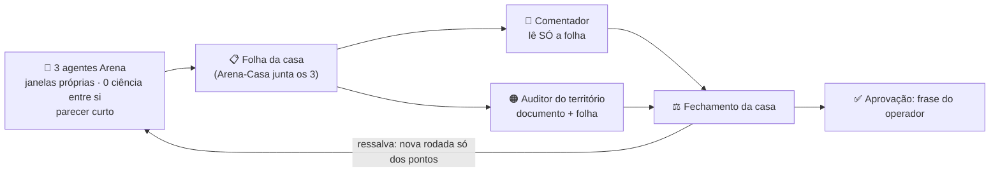

# 🧭 FLUXO DO CRIVO DOCUMENTAL — versão de 30/09/2026 (noite)

✏️ Arena (casa) · 📌 **decisão do operador**, registrada a partir da mensagem dele de 30/09/2026:
«O comentador é muito bom para crítica e aprovação, confirmou o fluxo, concordo com o 2 também».
Isto é **decisão de rito**. **Não** aprova documento algum: a vigência continua só por frase do operador.

**Vale para:** Livretos 1, 2, 3 e 4 (documentos sob crivo para o piloto oficial `B1.SM02.014`). **0 ciência.**

---

## 1️⃣ Por que mudou (em uma frase)

Nos claims, as 3 IAs **produzem** um parecer e os auditores **inspecionam** esse produto. Nos documentos o documento já existe: não havia produto das 3 IAs para os auditores inspecionarem. Agora há: a **folha** (passo 2).

## 2️⃣ O fluxo



| # | Quem | Faz | Recebe |
|---|---|---|---|
| 1 | 3 agentes Arena (modelos diferentes, se a plataforma deixar) | parecer curto (§4) | o documento e a base do livreto |
| 2 | Arena-Casa | monta a **folha** (§5) | os 3 pareceres |
| 3 | Comentador (ChatGPT) | crítica e recomendação (§7) | **só a folha** — nunca os documentos |
| 4 | Auditor do território | verifica o documento, guiado pela folha (§6) | documento + folha + só o que o território dele exige |
| 5 | Arena-Casa | fecha; ressalva abre nova rodada **só dos pontos** | tudo acima |
| 6 | Operador | aprova, ou não | o fechamento |

## 3️⃣ Quem audita qual documento (nível leve)

| Livreto | Documento | Auditor | Segundo auditor só se… |
|---|---|---|---|
| 1 | 1º IDS_OFICIAIS | Estrutura | a folha apontar ponto de governança |
| 2 | Protocolo de Escopo B1 v1.3 | Mestre | a folha apontar ponto de estrutura/schema |
| 3 | Lista Canônica B1/SM-02 v1.5 | Estrutura | a folha apontar ponto de governança |
| 4 | Bloco de Estado v1.8 | Estrutura | a folha tocar P1, P2 ou P4 (governança) → entra o Mestre |

**Nível completo** (os dois auditores sempre) só se o operador pedir.

## 4️⃣ Os 3 agentes Arena

Cada um recebe **os arquivos do pacote enxuto indicado no livreto, carregados no chat pelo operador** (sem acesso ao repositório). Cole **antes** do Prompt A do livreto (ele vale como está):

```text
ABERTURA PARA AGENTE ARENA — você recebeu apenas os arquivos carregados nesta conversa. Leia SÓ eles;
não procure nem busque outros arquivos. NÃO altere, crie, mova nem apague arquivo; NÃO faça
commit, push nem PR; NÃO rode scripts de produção. Responda só em texto.
FORMATO DO PARECER (máx. 12 linhas + tabela de pontos):
1) Veredito em uma linha: de acordo · com ressalva(s) · em desacordo (motivo).
2) Pontos, um por linha: nº · onde (seção/linha) · o fato medido · gravidade
   (BLOQUEIA · RESSALVA · OBSERVAÇÃO) · território (GOVERNANÇA · ESTRUTURA · AMBOS).
3) O que conferiu, com números (digital, IDs, versões).
Os PONTOS DE VERIFICAÇÃO do livreto são fatos a checar, NÃO correções prévias.
```

## 5️⃣ A folha (modelo — a casa preenche)

| Ponto | Agente 1 | Agente 2 | Agente 3 | Território | Gravidade |
|---|---|---|---|---|---|
| 1 | sim/não | sim/não | sim/não | GOV · EST · AMBOS | BLOQUEIA · RESSALVA · OBS |

Acima da tabela, 3 linhas: **resultado dos 3** (de acordo / com ressalva / em desacordo) · **pontos só de um agente** · **gatilho do 2º auditor** (sim/não, por quê). Regra: onde os agentes divergem, a casa **lê o documento**; não decide por votação.

## 6️⃣ Prompt do auditor (Mestre ou Estrutura)

```text
AUDITOR-[MESTRE | ESTRUTURA] — CRIVO DOCUMENTAL, [LIVRETO n de 4] — SESSÃO NOVA
Você recebe: o documento, a FOLHA dos 3 agentes e o que o seu território exige.
A folha é MAPA, não veredito: não se ancore nela.
1) Verifique, no documento, cada ponto da folha que caia no SEU território.
2) Rode a SUA lista própria.
   MESTRE: governança · contratos · rito · processo · aderência normativa.
   ESTRUTURA: estrutura · schemas · compatibilidade · materialização · coerência técnica.
3) Fora do seu território, leia só o necessário (economia de créditos).
PERGUNTA ÚNICA: "Concordam em declarar VIGENTE, para uso operacional no piloto oficial
B1.SM02.014, o [documento] (digital …)?"  RESPOSTA: de acordo · com ressalva · em desacordo (motivo).
0 ciência. Não altere o documento. Não execute scripts de produção. Não invente o que não recebeu.
```

## 7️⃣ Prompt do Comentador (só a folha; pede-se poupar o plano gratuito)

```text
COMENTADOR — CRIVO DOCUMENTAL — leia a FOLHA abaixo (não tem o documento; não peça o documento).
Critique: (a) lacuna que os 3 agentes não cobriram; (b) contradição entre pontos;
(c) o que falta para aprovar. Recomende: aprovável · aprovável com ressalvas (quais) ·
não aprovável (por quê). Sua recomendação é opinião: a aprovação é frase do operador.
0 ciência. Resposta em até 15 linhas.
```

## 8️⃣ Fechamento e rodadas

- **Ressalva** → nova rodada **só dos pontos** apontados (quem tinha ressalva revê; ninguém refaz tudo).
- **O documento sob crivo não muda antes do veredito.** Se mudar, muda a digital e a rodada recomeça.
- **Zelo proporcional:** ferramentas que serão aposentadas seguem o nível leve; nada de refinamento além do necessário.
- **Dependência:** o Livreto 1 segue sob crivo; se o veredito alterar o catálogo de IDs, refazer a conferência de IDs dos Livretos 2, 3 e 4.
- **Pré-requisito para abrir os 3 agentes:** o operador carrega, no chat de cada agente, os arquivos do pacote enxuto indicado no livreto (sem acesso ao repositório).
