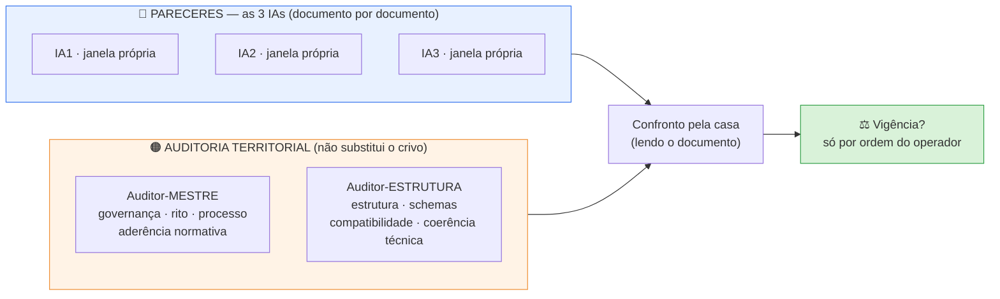

# 📘 CRIVO DOCUMENTAL — LIVRETO 2 de 4

> 🔄 **ATUALIZAÇÃO de 30/09/2026 (noite) — quem faz o quê mudou.** Vale o [`FLUXO_CRIVO_DOCUMENTAL_2026-09-30.md`](FLUXO_CRIVO_DOCUMENTAL_2026-09-30.md) (mesma pasta): 3 agentes Arena → folha da casa → Comentador → auditor do território. Neste livreto **valem** as seções de conteúdo (objeto, medições, pontos de verificação) e o **Prompt A** (com a abertura do fluxo, §4). **Não valem** o desenho de 5 janelas nem os Prompts B e C: use os prompts do fluxo (§6 e §7).

### `2º PROTOCOLO DE ESCOPO — B1 (v1.3).md` · pacote enxuto · cada um em chat novo

📅 **30/09/2026** · ✏️ Arena (casa) · 🔗 segue o modelo do Livreto 1 (`ENTREGAS/2026-09-29_CRIVO_LIVRETOS/`) · 🎨 padrão visual de `2026-09-30_PACOTES_CHAT_NOVOS`

---

## 🎯 O que este pacote pede

**Objeto:** declarar (ou não) **VIGENTE**, para uso operacional no piloto oficial `B1.SM02.014`, o **Protocolo de Escopo — B1 (v1.3)**.
**Régua:** Roteiro §6.1 — `EXISTENTE ≠ VALIDADO ≠ VIGENTE ≠ AUTORIZADO PARA USO`.
**Natureza:** crivo **documental**. **0 ciência** — não se julga conteúdo científico.
**Regra:** divergência se resolve **lendo o documento** — nunca por votação.

## 🗺️ Quem faz o quê (orientação do Comentador, repassada pelo operador)

> **Mantido só para memória.** O desenho de 5 janelas e os Prompts B e C abaixo foram substituídos; **valem os prompts do `FLUXO_CRIVO_DOCUMENTAL_2026-09-30.md` (§6 e §7)**.



- As **3 IAs** fazem os **pareceres individuais**; a **Casa** reúne, confronta e conduz o fechamento. Os **auditores** não substituem os pareceres.
- As **3 janelas das IAs são independentes**: ninguém vê o parecer do outro (**0 ciência**).
- **Pacote enxuto:** cada um recebe a **base comum indispensável** + **só o adicional** de que precisa.

---

## 1️⃣ O que é este documento (papel na obra)

É o **2º item do pacote mínimo obrigatório** do COMO EXECUTAR v1.11 rev.2 — *"fronteiras do mecanismo em trabalho"*. Diz, para o mecanismo **B1 (neuroinflamação)**:

| Bloco do arquivo | Em uma frase |
|---|---|
| `scope_in` / `scope_out` | o que entra e o que sai de B1 (e para qual mecanismo vai o que sai) |
| `nota_regra_fronteira_B1_B4_B5` | regra da **dupla fronteira** do quinolinato (B4 enzimologia · B5 excitotoxicidade) |
| `cross_ref_allowed_shorthand` + `cross_ref_ids_oficiais` | atalhos (B2, B3…) → **ID oficial completo** |
| `relacoes_cruzadas_semanticas` | a **natureza** de cada relação entre B1 e os outros mecanismos |
| `biomarcadores_referenciados` | quais têm ID oficial e quais estão só em candidatos (NLR, S100B) |
| `inclusion_criteria` / `exclusion_criteria` | trilha humana · trilha pré-clínica (sempre `preclinical_mechanistic`) · exclusões |

---

## 2️⃣ Cópias e digitais (medidas hoje, 30/09/2026)

| Peça | 📍 Caminho | 🔢 Digital | Observação |
|---|---|---|---|
| **Objeto (kit vigente)** | `uploads/Atuais/Documentos/2º PROTOCOLO DE ESCOPO — B1 (v1.3).md` | `943425cd…` | 161 linhas · 8.150 bytes · LF |
| Cópia idêntica | `BIBLIOTECAS/_documentos_serie/KIT_CLINICA_ATUALIZADO_recebido_2026-09-25/…` | `943425cd…` | idêntica |
| Cópia idêntica (proveniência) | `BIBLIOTECAS/_documentos_serie/KIT_CLINICA_recebido_2026-09-15/…` | `943425cd…` | idêntica — origem de 15/09 |

- 🟢 **Uma só versão** em três lugares (nenhuma variante).
- 🟡 **Não existe bilhete `*_VIGENTE.txt` próprio** para este documento — é justamente o que este crivo decide.
- ⏳ **Dependência registrada:** o Livreto 1 (`1º IDS_OFICIAIS`) **ainda aguarda veredito**. As conferências de ID abaixo usam o catálogo **como existe hoje** (`3c0eccac…`). Se o veredito do Livreto 1 alterar o catálogo, **repetir** a conferência de IDs.

---

## 3️⃣ O que a casa já mediu (conferência mecânica — **não** é o crivo)

| Conferência | Resultado |
|---|---|
| IDs oficiais citados no protocolo (`mecanismo_*`, `exame_*`) | **14 citados · 14 presentes** no `1º IDS_OFICIAIS` · 0 ausentes |
| Mapa atalho → ID (`cross_ref_ids_oficiais`) | 10 pares · **todos** existem em `mecanismos` do `_ids_oficiais.json` (16 mecanismos) |
| Campos do protocolo no Schema-Claim v1.3 rev.3 | `evidence_role` (com `preclinical_mechanistic`), `uso` e `referencia_cruzada` **existem** |
| Regra do protocolo × Schema | protocolo: pré-clínico **nunca** `clinical`; Schema: `preclinical_mechanistic` ⇒ `uso` **deve** ser `contexto_mecanistico` |
| Biomarcadores NLR e S100B | **não** estão no catálogo; **estão** em `CANDIDATOS_IDS_OFICIAIS — v1.0.md` (como o protocolo diz) |

---

## 4️⃣ 🔎 PONTOS DE VERIFICAÇÃO (para os auditores — **não** são correções prévias)

> Nada abaixo foi corrigido. Cada ponto traz **só o fato medido**; o julgamento é de quem audita.

### 🔎 V1 — referência a "Schema-Claim v1.2"
- **Onde:** `nota_v1.1` do protocolo manda ver *"Schema-Claim v1.2, evidence_role"*.
- **Fato:** o Schema-Claim **vigente** é **v1.3 rev.3** (`e9f9e5d8…`); nele, `evidence_role` está marcado **"idêntico ao v1.2"**.

### 🔎 V2 — referência a `CANDIDATOS_IDS_OFICIAIS.yaml`
- **Onde:** `nota_v1.2` do protocolo cita o arquivo com extensão `.yaml`; o campo `ver:` usa o nome sem extensão.
- **Fato:** no kit, o arquivo é `CANDIDATOS_IDS_OFICIAIS — v1.0.md` (`a069de5f…`). O **COMO EXECUTAR v1.11 rev.2** vigente também escreve `.yaml` (linhas 125, 605 e 620).

### 🔎 V3 — data interna `last_updated: 2026-08-04`
- **Fato:** o arquivo declara `version: 1.3`, `status: ativo`, `last_updated: 2026-08-04`. A cópia de proveniência é do **kit recebido em 15/09**. O arquivo **não** traz digital nem referência a bilhete de vigência.

### 🔎 V4 — claim `.011`: "quando aprovado em G3" × estado atual (cruza com o Livreto 3)
- **Fato:** o protocolo diz que, *quando aprovado em G3*, o `.011` **deve** incluir `[B4, B5]` em `referencia_cruzada`. Na Lista Canônica v1.5 o `.011` consta `aprovado_com_ressalva` com `referencia_cruzada: [mecanismo_B4…, mecanismo_B5…, cenario_E99_urgencias_psiquiatricas]` (linhas 281–296; nota nas linhas 88–96). O ID `cenario_E99_…` **existe** no catálogo.

### 🔎 V5 — atalhos permitidos × mapa de IDs
- **Fato:** `cross_ref_allowed_shorthand` lista **8** atalhos (B2, B3, B5, B6, B7, B9, B10, B16); `cross_ref_ids_oficiais` mapeia **10** (os 8 + **B4** e **B12**, com comentários de uso: regra da quinurenina e `.007b`).

---

## 5️⃣ As 5 perguntas do §6.1 (para todos)

1. **É o documento correto?** (papel/nome/lugar — item 2 do pacote mínimo)
2. **Está na versão correta?** (as três cópias são idênticas; nenhuma posterior o substitui?)
3. **Possui vigência?** (não há bilhete próprio)
4. **Foi aprovado pelo rito aplicável?** (histórico + este crivo)
5. **Não foi substituído por versão posterior?**

E ainda, no território de cada um:
- 🔵 **IAs:** coerência interna · 14 IDs ↔ catálogo · sem contradição com Schema-Claim v1.3 rev.3 e COMO EXECUTAR v1.11 rev.2 · V1–V5.
- 🟠 **Mestre:** rito, governança e aderência normativa — **V1, V2, V3** e a ausência de bilhete.
- 🟠 **Estrutura:** estrutura, compatibilidade com Schema-Claim e catálogo — **V1, V2, V4, V5**.

---

## 6️⃣ Pergunta única

> **"Concordam em declarar VIGENTE, para uso operacional no piloto oficial B1.SM02.014, o `2º PROTOCOLO DE ESCOPO — B1 (v1.3).md` (digital `943425cd…`)?"**

Resposta: **sim** · **sim, com ressalva(s)** (listar) · **não** (motivo).
*(Os auditores respondem no seu território: **de acordo / de acordo com ressalva / em desacordo**.)*

**Formato (todos):** veredito em **uma linha** · razões · achados **não bloqueantes** · o que conferiu, **com números**. **0 ciência.**

---

## 7️⃣ 📎 O que cada um recebe (pacote enxuto)

> **Sobre a coluna Caminho:** o caminho só **identifica** qual é o arquivo; o conteúdo chega **carregado no chat pelo operador**. Não procure outros arquivos.

### 🟦 BASE COMUM — os 5 (nesta ordem)

| # | Arquivo | 📍 Caminho | 🔢 Digital |
|---|---|---|---|
| 1 | **Roteiro vigente** ✅ | `ROTEIRO DE TRABALHO DA PLATAFORMA.md` (raiz) | `507eaefa…` |
| 2 | **COMO EXECUTAR v1.11 rev.2** | `BIBLIOTECAS/_documentos_serie/COMO_EXECUTAR_v1.11rev2_vigente_2026-09-25/4º COMO EXECUTAR — v1.11 rev.2.md` | `1ea6d354…` |
| 3 | **Schema-Claim v1.3 rev.3** | `BIBLIOTECAS/_documentos_serie/SCHEMA_CLAIM_v1.3_rev3_vigente_2026-09-25/3º SCHEMA-CLAIM — v1.3.md` | `e9f9e5d8…` |
| 4 | **1º IDS_OFICIAIS** (vocabulário) | `uploads/Atuais/Documentos/1º IDS_OFICIAIS.md` | `3c0eccac…` |
| 5 | 🎯 **OBJETO — Protocolo de Escopo B1 v1.3** | `uploads/Atuais/Documentos/2º PROTOCOLO DE ESCOPO — B1 (v1.3).md` | `943425cd…` |

> ✅ **Roteiro conferido hoje:** o arquivo da raiz (`507eaefa…`, 37.919 bytes, 1.171 linhas, errata 29/09) é **idêntico** ao que o bilhete `ROTEIRO_PLATAFORMA_VIGENTE.txt` declara vigente. As versões de 26/09 (`5f8b89dc…`), 27/09 (`2c286ca1…`) e as de `uploads/Antigos/` são **históricas** e **não** entram.

### ➕ ADICIONAL — só o necessário

| Quem | Adicional | 📍 Caminho | 🔢 Digital | Para quê |
|---|---|---|---|---|
| 🔵 **IA1 · IA2 · IA3** | CANDIDATOS | `uploads/Atuais/Documentos/CANDIDATOS_IDS_OFICIAIS — v1.0.md` | `a069de5f…` | V2 (NLR, S100B) |
| 🟠 **Mestre** | Bilhete do Roteiro | `BIBLIOTECAS/_documentos_serie/ROTEIRO_PLATAFORMA_VIGENTE.txt` | — | confirmar vigência do Roteiro |
| 🟠 **Mestre** | Bilhete do COMO EXECUTAR | `BIBLIOTECAS/_documentos_serie/COMO_EXECUTAR_V111_VIGENTE.txt` | — | rito aplicável |
| 🟠 **Mestre** | CANDIDATOS | (mesmo arquivo acima) | `a069de5f…` | V2 |
| 🟠 **Estrutura** | CANDIDATOS | (mesmo arquivo acima) | `a069de5f…` | V2 |
| 🟠 **Estrutura** | `_ids_oficiais.json` (derivado) | `Ferramentas de geração e auditoria/01_norteadores/_derivados_trilha46/_ids_oficiais.json` | `d0ff2647…` | caminho `_ids_oficiais.mecanismos` que o protocolo cita |
| 🟠 **Estrutura** | **Trecho** da Lista Canônica v1.5 | `uploads/Atuais/Documentos/5º_LISTA_CANÔNICA___B1__SM-02_V1_5.md` — **só** linhas 88–96 e 281–296 | `20efa89f…` (arquivo inteiro) | V4 |

### 🚫 Fora (Nível C — não anexar)
Anamnese · bibliotecas de conteúdo · ciência clínica · Bloco de Estado · Estrutura Mestre · Filosofia · Decisões Arquiteturais · L06 · Contrato de Saída · schemas N1/N2.
*(Se algum auditor julgar que precisa de uma dessas peças, **pede**; a casa entrega só aquela.)*

---

## ✉️ PROMPT A — 🔵 IA1 / IA2 / IA3 (o mesmo texto; cada uma em janela própria)

```text
CRIVO DOCUMENTAL — LIVRETO 2 de 4 — SESSÃO NOVA

Você é uma das três IAs (IA1, IA2, IA3) que dão o parecer individual, documento
por documento, antes de cada documento ser considerado vigente. Você trabalha em janela
própria, SEM ver o parecer das outras. Divergência se resolve lendo o documento, nunca
por votação; o confronto e o fechamento são da Casa. Crivo DOCUMENTAL: 0 ciência (não julgue conteúdo científico).

OBJETO: 2º PROTOCOLO DE ESCOPO — B1 (v1.3).md (digital 943425cd…).
RÉGUA: Roteiro §6.1 — EXISTENTE ≠ VALIDADO ≠ VIGENTE ≠ AUTORIZADO PARA USO.

ANEXOS (nesta ordem): 1 Roteiro vigente (507eaefa) · 2 COMO EXECUTAR v1.11 rev.2 (1ea6d354)
· 3 Schema-Claim v1.3 rev.3 (e9f9e5d8) · 4 1º IDS_OFICIAIS (3c0eccac) · 5 OBJETO (943425cd)
· adicional: CANDIDATOS_IDS_OFICIAIS v1.0 (a069de5f).

FAÇA: (a) as 5 perguntas do §6.1; (b) confira os IDs citados no objeto contra o
catálogo, com números; (c) confira contradição com o Schema-Claim e o COMO EXECUTAR;
(d) examine os PONTOS DE VERIFICAÇÃO V1–V5 — são pontos a verificar, NÃO correções
prévias: não corrija nada, não reescreva o documento.

PERGUNTA ÚNICA: "Concordam em declarar VIGENTE, para uso operacional no piloto oficial
B1.SM02.014, o 2º PROTOCOLO DE ESCOPO — B1 (v1.3), digital 943425cd…?"
RESPOSTA: sim · sim, com ressalva(s) (listar) · não (motivo).

FORMATO: veredito em uma linha · razões · achados não bloqueantes · o que conferiu, com números.
Não execute os scripts de produção. Não invente documento que não recebeu — peça-o.
```

## ✉️ PROMPT B — 🟠 AUDITOR-MESTRE

> **Mantido só para memória.** Vale o prompt do `FLUXO_CRIVO_DOCUMENTAL_2026-09-30.md` (§6).

```text
AUDITOR-MESTRE — SESSÃO NOVA — CRIVO DOCUMENTAL, LIVRETO 2 de 4

Você é o Auditor-Mestre: governança, contratos, rito, processo e aderência normativa.
Sua auditoria NÃO substitui o crivo das três IAs e é independente da auditoria do
Auditor-Estrutura: janela própria, sem ciência do parecer dele. 0 ciência.

OBJETO: 2º PROTOCOLO DE ESCOPO — B1 (v1.3).md (digital 943425cd…).
ANEXOS: 1 Roteiro vigente (507eaefa) · 2 COMO EXECUTAR v1.11 rev.2 (1ea6d354) ·
3 Schema-Claim v1.3 rev.3 (e9f9e5d8) · 4 1º IDS_OFICIAIS (3c0eccac) · 5 OBJETO ·
adicionais: ROTEIRO_PLATAFORMA_VIGENTE.txt · COMO_EXECUTAR_V111_VIGENTE.txt ·
CANDIDATOS_IDS_OFICIAIS v1.0 (a069de5f).

SEU TERRITÓRIO: o documento tem papel, versão, vigência e rito de aprovação coerentes
com o Roteiro §6.1 e com o COMO EXECUTAR? Examine V1, V2 e V3 (pontos de verificação,
NÃO correções prévias) e a ausência de bilhete de vigência próprio.

RESPOSTA: de acordo · de acordo com ressalva(s) · em desacordo (motivo).
FORMATO: veredito em uma linha · razões · achados não bloqueantes · o que conferiu, com números.
Não corrija o documento. Não invente peça que não recebeu — peça-a.
```

## ✉️ PROMPT C — 🟠 AUDITOR-ESTRUTURA

> **Mantido só para memória.** Vale o prompt do `FLUXO_CRIVO_DOCUMENTAL_2026-09-30.md` (§6).

```text
AUDITOR-ESTRUTURA — SESSÃO NOVA — CRIVO DOCUMENTAL, LIVRETO 2 de 4

Você é o Auditor-Estrutura: estrutura, schemas, compatibilidade, materialização e
coerência técnica. Sua auditoria NÃO substitui o crivo das três IAs e é independente da
auditoria do Auditor-Mestre: janela própria, sem ciência do parecer dele. 0 ciência.

OBJETO: 2º PROTOCOLO DE ESCOPO — B1 (v1.3).md (digital 943425cd…).
ANEXOS: 1 Roteiro vigente (507eaefa) · 2 COMO EXECUTAR v1.11 rev.2 (1ea6d354) ·
3 Schema-Claim v1.3 rev.3 (e9f9e5d8) · 4 1º IDS_OFICIAIS (3c0eccac) · 5 OBJETO ·
adicionais: CANDIDATOS_IDS_OFICIAIS v1.0 (a069de5f) · _ids_oficiais.json derivado
(d0ff2647) · TRECHO da Lista Canônica v1.5 (linhas 88–96 e 281–296).

SEU TERRITÓRIO: a estrutura do objeto é compatível com o Schema-Claim v1.3 rev.3 e com
o catálogo? Os atalhos e IDs resolvem para o caminho _ids_oficiais.mecanismos? Examine
V1, V2, V4 e V5 (pontos de verificação, NÃO correções prévias).

RESPOSTA: de acordo · de acordo com ressalva(s) · em desacordo (motivo).
FORMATO: veredito em uma linha · razões · achados não bloqueantes · o que conferiu, com números.
Não corrija o documento. Não invente peça que não recebeu — peça-a.
```

---

## 📌 Depois dos vereditos

1. A Casa **confronta** os pareceres recebidos, **lendo o documento** (nunca por votação) e registra o resultado.
2. **Vigência só por ordem do operador.** Este pacote **não declara nada vigente**.
3. Seguem, **um por um**: Livreto 3 (`5º Lista Canônica — B1/SM-02 v1.5`) · Livreto 4 (`6º Bloco de Estado v1.8`).

*Nenhuma linha de ciência foi lida, alterada ou julgada para montar este pacote.*
