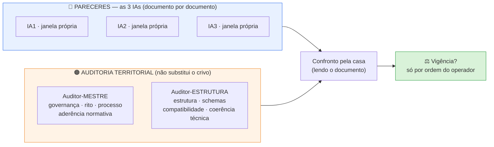

# 📗 CRIVO DOCUMENTAL — LIVRETO 3 de 4

> 🔄 **ATUALIZAÇÃO de 30/09/2026 (noite) — quem faz o quê mudou.** Vale o [`FLUXO_CRIVO_DOCUMENTAL_2026-09-30.md`](FLUXO_CRIVO_DOCUMENTAL_2026-09-30.md) (mesma pasta): 3 agentes Arena → folha da casa → Comentador → auditor do território. Neste livreto **valem** as seções de conteúdo (objeto, medições, pontos de verificação) e o **Prompt A** (com a abertura do fluxo, §4). **Não valem** o desenho de 5 janelas nem os Prompts B e C: use os prompts do fluxo (§6 e §7).

### `5º LISTA CANÔNICA — B1 / SM-02 (v1.5).md` · pacote enxuto · cada um em chat novo

📅 **30/09/2026** · ✏️ Arena (casa) · 🔗 mesmo molde do Livreto 2 (`LIVRETO_02_PROTOCOLO_ESCOPO_B1_2026-09-30.md`) · 🎨 padrão visual de `2026-09-30_PACOTES_CHAT_NOVOS`

---

## 🎯 O que este pacote pede

**Objeto:** declarar (ou não) **VIGENTE**, para uso operacional no piloto oficial `B1.SM02.014`, a **Lista Canônica — B1 / SM-02 (v1.5)**.
**Régua:** Roteiro §6.1 — `EXISTENTE ≠ VALIDADO ≠ VIGENTE ≠ AUTORIZADO PARA USO`.
**Natureza:** crivo **documental**. **0 ciência** — não se julga conteúdo científico (queries, PMIDs, achados).
**Regra:** divergência se resolve **lendo o documento** — nunca por votação.
**O documento fica intacto:** este pacote é um arquivo **à parte**; nada na Lista foi alterado para montá-lo.

## 🗺️ Quem faz o quê (orientação do Comentador, repassada pelo operador)

> **Mantido só para memória.** O desenho de 5 janelas e os Prompts B e C abaixo foram substituídos; **valem os prompts do `FLUXO_CRIVO_DOCUMENTAL_2026-09-30.md` (§6 e §7)**.



- As **3 IAs** fazem os **pareceres individuais**; a **Casa** reúne, confronta e conduz o fechamento. Os **auditores** não substituem os pareceres.
- As **3 janelas das IAs são independentes**: ninguém vê o parecer do outro (**0 ciência**).
- **Pacote enxuto:** base comum indispensável + **só o adicional** necessário a cada um.

---

## 1️⃣ O que é este documento (papel na obra)

É o **5º item do pacote mínimo obrigatório** do COMO EXECUTAR v1.11 rev.2 — *"os alvos de trabalho do submódulo ativo"*. É a **lista de claims-alvo** do submódulo **SM-02 (Prova de Existência)** do mecanismo B1.

> 🔑 **Por que ele pesa:** o Schema-Claim v1.3 rev.3 (`nota_namespace`) diz que `claim_id` **não** é validado contra o catálogo de IDs — é validado **exclusivamente contra a Lista Canônica do submódulo de origem**. Ou seja: **é esta Lista que define quais `claim_id` existem.** O claim do piloto, `B1.SM02.014`, tem a sua entrada nela.

| Bloco do arquivo | Em uma frase |
|---|---|
| Cabeçalho (linhas 1–67) | histórico de versões v1.0 → v1.5 e o que mudou em cada uma |
| `nota_destino` · `nota_auditoria` | para onde vão os claims de SM-02; "esquema de 35 é o único válido" |
| `nota_regra_fronteira_B1_B4_B5` | regra da dupla fronteira do quinolinato (a mesma do Protocolo de Escopo) |
| `status_geral` | contadores: 15 aprovados · 8 subclaims · 4 em busca · 16 pendentes · próximo alvo |
| `grupo_1` … `grupo_6` | as **43 entradas** (35 claims + 8 subclaims): id · status · claim · query · trilha · fontes |
| `fila_futura_outros_submodulos` | PMIDs que pertencem a outros submódulos (não é rejeição) |
| `fila_realocacao` · `redirecionados` | PMIDs que pertencem a outro lugar / pré-clínicos encontrados na trilha humana |

---

## 2️⃣ Cópias e digitais (medidas hoje, 30/09/2026)

| Peça | 📍 Caminho | 🔢 Digital | Observação |
|---|---|---|---|
| **Objeto (kit vigente)** | `uploads/Atuais/Documentos/5º_LISTA_CANÔNICA___B1__SM-02_V1_5.md` | `20efa89f…` | 673 linhas · 42.865 bytes · LF · 0 CR · 0 TAB |
| Cópia idêntica | `BIBLIOTECAS/_documentos_serie/KIT_CLINICA_ATUALIZADO_recebido_2026-09-25/5º_LISTA_CANÔNICA___B1__SM-02_V1_5.md` | `20efa89f…` | idêntica |
| 🕰️ Versão anterior (histórica) | `uploads/Antigos/Documentos/5º LISTA CANÔNICA — B1  SM-02 V1.3.md` e `KIT_CLINICA_recebido_2026-09-15/…` | `25478aee…` | **v1.3** — substituída, **não entra** |
| ⚠️ **NÃO é cópia** | `Ferramentas de geração e auditoria/02_fase1_gpm_profundidade/7º LISTA CANÔNICA — B1 TRILHA MECANÍSTICA GPM_B1 ARENA.md` | `136c7fc6…` | **outro documento** (trilha mecanística, nome parecido) — **não anexar** |

- 🟢 **Uma só versão vigente** da Lista de SM-02 em dois lugares (nenhuma variante).
- 🟡 **Não existe bilhete `*_VIGENTE.txt` próprio** para este documento — é justamente o que este crivo decide.
- ⏳ **Dependências registradas (ainda sem veredito):**
  - **Livreto 1** (`1º IDS_OFICIAIS`) — a conferência de IDs abaixo usa o catálogo **como existe hoje** (`3c0eccac…`).
  - **Livreto 2** (Protocolo de Escopo) — a regra de fronteira da Lista cita o Protocolo.
  - **Livreto 4** (Bloco de Estado v1.8) — **ainda não montado**; a Lista e o Bloco se citam mutuamente.
  Se algum desses vereditos mudar o documento, **repetir** a conferência correspondente.

---

## 3️⃣ O que a casa já mediu (conferência mecânica — **não** é o crivo)

| Conferência | Resultado |
|---|---|
| Forma do arquivo | 673 linhas · LF · **0 TAB** · **0 CR** · termina com quebra de linha |
| Chaves de 1º nível | **14 · nenhuma repetida** (o histórico da v1.3 registra que chaves repetidas já foram um defeito) |
| Chaves repetidas dentro de uma entrada | **0** |
| Entradas `- id:` | **43 = 35 claims** (`.001`…`.035`, **nenhum faltando**) **+ 8 subclaims** · **0 IDs duplicados** |
| Status das 43 entradas | 15 `aprovado_com_ressalva` · 8 `aprovado` · 4 `em_busca` · 16 `pendente` |
| Contadores × entradas | `status_geral` (15 aprovados + 4 em busca + 16 pendentes = 35; 8 subclaims) **bate** com as entradas (11 + 4 = 15 principais aprovados) |
| Lista × Bloco de Estado v1.8 | o Bloco declara "**23** entradas aprovadas (15 principais + 8 subclaims)" — **bate** com a Lista (15 + 8) |
| Campos obrigatórios por entrada | `status`, `claim`, `filtro_desenho_na_query`, `trilha`: **43/43** · `query`: **35/35 claims** (os 8 subclaims herdam: `herda_da_query_pai`) · `fontes`: **todas as entradas aprovadas** |
| Trilha | **43/43 `humana`** (como diz `nota_trilha_constante`) |
| IDs oficiais citados (`mecanismo_*`, `cenario_*`) | **8 citados · 8 presentes** no `1º IDS_OFICIAIS` · 0 ausentes |
| `referencia_cruzada` preenchida | `.007b` → B12 · `.011` → B4 + B5 + `cenario_E99_…` · `.013` → B3 — **todos existem** no catálogo |
| Filas de PMIDs | `fila_realocacao`: **35**, **sem repetição**, nenhum repete fonte de claim · `fila_futura`: 6 itens (5 com PMID), nenhum repete fonte de claim |
| PMIDs em `fontes` de mais de um claim | 10 (ex.: claim-pai e seu subclaim; `.014` e `.015`) — **registro factual**, sem julgamento |
| Ponta do piloto | `B1.SM02.014`: entrada nas **linhas 355–400** · `status: aprovado_com_ressalva` · com `query_historico` e `resultados_query` (linha 372) |

---

## 4️⃣ 🔎 PONTOS DE VERIFICAÇÃO (para os auditores — **não** são correções prévias)

> Nada abaixo foi corrigido. Cada ponto traz **só o fato medido**; o julgamento é de quem audita.

### 🔎 L1 — "Schema-Claim v1.2" como formato de saída
- **Onde:** `nota_destino` (linha 76): *"Formato de saída: Schema-Claim v1.2 até decisão do schema de evidencias/bibliografia."*
- **Fato:** o Schema-Claim **vigente** é **v1.3 rev.3** (`e9f9e5d8…`). A mesma frase aparece no cabeçalho do Bloco de Estado v1.7 e na Estrutura Mestre v2.2 (linha 39, "provisório").
- *(Mesmo tipo de achado do ponto V1 do Livreto 2.)*

### 🔎 L2 — valor de status `pendente`
- **Fato:** a Lista usa `status: pendente` em **16 entradas**. O enum de `status` do Schema-Claim v1.3 rev.3 (linha 53) é `aprovado | aprovado_com_ressalva | em_busca | rejeitado | aposentado` — **sem `pendente`**. O COMO EXECUTAR usa a palavra "pendente" no texto (linhas 111, 538, 550).
- **Contexto registrado no cabeçalho da Lista (v1.3):** *"valor precisa bater exato com o enum do Schema-Claim"*.

### 🔎 L3 — "aprovados" × `aprovado_com_ressalva`
- **Fato:** `aprovados_principais: 15  # .001-.015` = **11** `aprovado_com_ressalva` + **4** `aprovado`. O texto de `nota_priorizacao` diz "`.014` e `.015` aprovados"; ambos constam `aprovado_com_ressalva`. O cabeçalho v1.5 (linha 5) registra ".014 aprovado_com_ressalva".

### 🔎 L4 — referências a "Bloco de Estado v1.7" e a pendência P2
- **Onde:** cabeçalho (v1.4, linhas 12–13, 24) e rodapé (linhas 672–673) citam o **Bloco de Estado v1.7**.
- **Fato:** o Bloco em vigor no kit é o **v1.8** (17/09), que declara "**P1 e P2 seguem abertas**". A `nota_conflito_pendente` (PMIDs 33339712 e 30696814; v1.3: *"conflito marcado, não resolvido sozinho"*) foi movida para **P2** e **continua aberta**.

### 🔎 L5 — Estrutura Mestre v2.2 × Lista v1.5
- **Fato:** a Estrutura Mestre v2.2 (16/09) registra `lista_canonica_ativa: "Lista Canônica — SM-02 v1.4"`, `estado: "Bloco de Estado v1.7"`, SM-02 com "14 principais + 8 subclaims" e **17** pendentes. A Lista v1.5 tem **15** principais aprovados e **16** pendentes. A Estrutura Mestre **não** faz parte do pacote mínimo (só entra em decisão de escopo maior).

### 🔎 L6 — `.011`: três itens em `referencia_cruzada` (cruza com o Livreto 2, ponto V4)
- **Fato:** a `nota_regra_fronteira_B1_B4_B5` (linhas 85–96) diz que o `.011`, *"quando aprovado"*, referencia **ambos** `[B4, B5]`; a entrada `.011` (linha 281) consta `aprovado_com_ressalva` e lista **três** IDs (os dois + `cenario_E99_urgencias_psiquiatricas`, que existe no catálogo). O cabeçalho v1.3 registra que o `referencia_cruzada` real do `.011` "inclui cenario_E99_urgencias_psiquiatricas".

### 🔎 L7 — papel, nome e vigência do arquivo
- **Fato:** o arquivo declara `v1.5 — 2026-09-17` e não traz bilhete de vigência. O nome do arquivo no kit (`5º_LISTA_CANÔNICA___B1__SM-02_V1_5.md`) difere do padrão das versões anteriores (`5º LISTA CANÔNICA — B1  SM-02 V1.3.md`) — o conteúdo é o mesmo documento, em versão nova. Existe um documento de **nome parecido** (`7º LISTA CANÔNICA — B1 TRILHA MECANÍSTICA…`) que **não** é este.

---

## 5️⃣ As 5 perguntas do §6.1 (para todos)

1. **É o documento correto?** (papel/nome/lugar — item 5 do pacote mínimo; **não** é o `7º … TRILHA MECANÍSTICA`)
2. **Está na versão correta?** (v1.5; as duas cópias são idênticas; a v1.3 é histórica)
3. **Possui vigência?** (não há bilhete próprio)
4. **Foi aprovado pelo rito aplicável?** (histórico do cabeçalho + este crivo)
5. **Não foi substituído por versão posterior?**

E ainda, no território de cada um:
- 🔵 **IAs:** coerência interna (43 entradas, contadores, status) · IDs ↔ catálogo · sem contradição com Schema-Claim v1.3 rev.3, COMO EXECUTAR v1.11 rev.2 e Protocolo de Escopo · **L1–L7**.
- 🟠 **Mestre:** rito, governança, cadeia de versões e aderência normativa — **L1, L4, L5, L7** e a ausência de bilhete.
- 🟠 **Estrutura:** estrutura, compatibilidade com o Schema-Claim e o catálogo — **L1, L2, L3, L6** (e a forma do arquivo: YAML, chaves, contadores).

---

## 6️⃣ Pergunta única

> **"Concordam em declarar VIGENTE, para uso operacional no piloto oficial B1.SM02.014, a `5º LISTA CANÔNICA — B1 / SM-02 (v1.5)` (digital `20efa89f…`, 35 claims + 8 subclaims)?"**

Resposta: **sim** · **sim, com ressalva(s)** (listar) · **não** (motivo).
*(Os auditores respondem no seu território: **de acordo / de acordo com ressalva / em desacordo**.)*

**Formato (todos):** veredito em **uma linha** · razões · achados **não bloqueantes** · o que conferiu, **com números**. **0 ciência.**

---

## 7️⃣ 📎 O que cada um recebe (pacote enxuto)

> **Sobre a coluna Caminho:** o caminho só **identifica** qual é o arquivo; o conteúdo chega **carregado no chat pelo operador**. Não procure outros arquivos.

### 🟦 BASE COMUM — os 5 (nesta ordem)

| # | Arquivo | 📍 Caminho | 🔢 Digital |
|---|---|---|---|
| 1 | **Roteiro vigente** ✅ | `ROTEIRO DE TRABALHO DA PLATAFORMA.md` (raiz) | `507eaefa…` |
| 2 | **COMO EXECUTAR v1.11 rev.2** | `BIBLIOTECAS/_documentos_serie/COMO_EXECUTAR_v1.11rev2_vigente_2026-09-25/4º COMO EXECUTAR — v1.11 rev.2.md` | `1ea6d354…` |
| 3 | **Schema-Claim v1.3 rev.3** | `BIBLIOTECAS/_documentos_serie/SCHEMA_CLAIM_v1.3_rev3_vigente_2026-09-25/3º SCHEMA-CLAIM — v1.3.md` | `e9f9e5d8…` |
| 4 | **1º IDS_OFICIAIS** (vocabulário) | `uploads/Atuais/Documentos/1º IDS_OFICIAIS.md` | `3c0eccac…` |
| 5 | 🎯 **OBJETO — Lista Canônica B1/SM-02 v1.5** | `uploads/Atuais/Documentos/5º_LISTA_CANÔNICA___B1__SM-02_V1_5.md` | `20efa89f…` |

> ✅ **Roteiro conferido hoje:** o arquivo da raiz (`507eaefa…`, 37.919 bytes, 1.171 linhas, errata 29/09) é **idêntico** ao que o bilhete `ROTEIRO_PLATAFORMA_VIGENTE.txt` declara vigente. As versões de 26/09 (`5f8b89dc…`), de 27/09 (`2c286ca1…`) e as de `uploads/Antigos/` são **históricas** e **não** entram.

### ➕ ADICIONAL — só o necessário

| Quem | Adicional | 📍 Caminho | 🔢 Digital | Para quê |
|---|---|---|---|---|
| 🔵🟠 **os 5** | Protocolo de Escopo B1 v1.3 | `uploads/Atuais/Documentos/2º PROTOCOLO DE ESCOPO — B1 (v1.3).md` | `943425cd…` | regra de fronteira B1/B4/B5 e L6 *(pequeno: 161 linhas)* |
| 🔵🟠 **os 5** | **Trecho** do Bloco de Estado v1.8 — **só linhas 1–40** | `uploads/Atuais/Documentos/6º BLOCO_DE_ESTADO__v1_8.md` | `7db41d40…` (arquivo inteiro) | L3, L4 (contadores e P1/P2) |
| 🟠 **Mestre** | Bilhete do Roteiro | `BIBLIOTECAS/_documentos_serie/ROTEIRO_PLATAFORMA_VIGENTE.txt` | — | confirmar vigência do Roteiro |
| 🟠 **Mestre** | Bilhete do COMO EXECUTAR | `BIBLIOTECAS/_documentos_serie/COMO_EXECUTAR_V111_VIGENTE.txt` | — | rito aplicável |
| 🟠 **Mestre** e 🟠 **Estrutura** | **Trecho** da Estrutura Mestre v2.2 — **só linhas 36–40, 62–65 e 100–114** | `uploads/Atuais/Documentos/ESTRUTURA_MESTRE_v2_2.md` | `f6e54545…` (arquivo inteiro) | L1, L5 |

### 🚫 Fora (Nível C — não anexar)
Anamnese · bibliotecas de conteúdo · ciência clínica · Bloco de Estado **inteiro** · Estrutura Mestre **inteira** · Filosofia · Decisões Arquiteturais · L06 · Contrato de Saída · schemas N1/N2 · `CANDIDATOS_IDS_OFICIAIS` · o `7º LISTA CANÔNICA — TRILHA MECANÍSTICA` (outro documento).
*(Se algum auditor julgar que precisa de uma dessas peças, **pede**; a casa entrega só aquela.)*

---

## ✉️ PROMPT A — 🔵 IA1 / IA2 / IA3 (o mesmo texto; cada uma em janela própria)

```text
CRIVO DOCUMENTAL — LIVRETO 3 de 4 — SESSÃO NOVA

Você é uma das três IAs (IA1, IA2, IA3) que dão o parecer individual, documento
por documento, antes de cada documento ser considerado vigente. Você trabalha em janela
própria, SEM ver o parecer das outras. Divergência se resolve lendo o documento, nunca
por votação; o confronto e o fechamento são da Casa. Crivo DOCUMENTAL: 0 ciência (não julgue queries, PMIDs nem achados).

OBJETO: 5º LISTA CANÔNICA — B1 / SM-02 (v1.5) (digital 20efa89f…).
RÉGUA: Roteiro §6.1 — EXISTENTE ≠ VALIDADO ≠ VIGENTE ≠ AUTORIZADO PARA USO.

ANEXOS (nesta ordem): 1 Roteiro vigente (507eaefa) · 2 COMO EXECUTAR v1.11 rev.2 (1ea6d354)
· 3 Schema-Claim v1.3 rev.3 (e9f9e5d8) · 4 1º IDS_OFICIAIS (3c0eccac) · 5 OBJETO (20efa89f)
· adicionais: Protocolo de Escopo B1 v1.3 (943425cd) · TRECHO do Bloco de Estado v1.8
(apenas linhas 1–40).

FAÇA: (a) as 5 perguntas do §6.1; (b) confira a coerência interna do objeto (43 entradas =
35 claims + 8 subclaims; status; contadores de status_geral), com números; (c) confira os
IDs oficiais citados contra o catálogo; (d) confira contradição com o Schema-Claim, o
COMO EXECUTAR e o Protocolo de Escopo; (e) examine os PONTOS DE VERIFICAÇÃO L1–L7 — são
pontos a verificar, NÃO correções prévias: não corrija nada, não reescreva o documento.

PERGUNTA ÚNICA: "Concordam em declarar VIGENTE, para uso operacional no piloto oficial
B1.SM02.014, a 5º LISTA CANÔNICA — B1 / SM-02 (v1.5), digital 20efa89f…?"
RESPOSTA: sim · sim, com ressalva(s) (listar) · não (motivo).

FORMATO: veredito em uma linha · razões · achados não bloqueantes · o que conferiu, com números.
Não execute os scripts de produção. Não invente documento que não recebeu — peça-o.
```

## ✉️ PROMPT B — 🟠 AUDITOR-MESTRE

> **Mantido só para memória.** Vale o prompt do `FLUXO_CRIVO_DOCUMENTAL_2026-09-30.md` (§6).

```text
AUDITOR-MESTRE — SESSÃO NOVA — CRIVO DOCUMENTAL, LIVRETO 3 de 4

Você é o Auditor-Mestre: governança, contratos, rito, processo e aderência normativa.
Sua auditoria NÃO substitui o crivo das três IAs e é independente da auditoria do
Auditor-Estrutura: janela própria, sem ciência do parecer dele. 0 ciência.

OBJETO: 5º LISTA CANÔNICA — B1 / SM-02 (v1.5) (digital 20efa89f…).
ANEXOS: 1 Roteiro vigente (507eaefa) · 2 COMO EXECUTAR v1.11 rev.2 (1ea6d354) ·
3 Schema-Claim v1.3 rev.3 (e9f9e5d8) · 4 1º IDS_OFICIAIS (3c0eccac) · 5 OBJETO ·
adicionais: Protocolo de Escopo B1 v1.3 (943425cd) · TRECHO do Bloco de Estado v1.8
(linhas 1–40) · ROTEIRO_PLATAFORMA_VIGENTE.txt · COMO_EXECUTAR_V111_VIGENTE.txt ·
TRECHO da Estrutura Mestre v2.2 (linhas 36–40, 62–65 e 100–114).

SEU TERRITÓRIO: o documento tem papel, versão, cadeia de versões, vigência e rito de
aprovação coerentes com o Roteiro §6.1 e com o COMO EXECUTAR? Examine L1, L4, L5 e L7
(pontos de verificação, NÃO correções prévias), a pendência P2 registrada e a ausência
de bilhete de vigência próprio.

RESPOSTA: de acordo · de acordo com ressalva(s) · em desacordo (motivo).
FORMATO: veredito em uma linha · razões · achados não bloqueantes · o que conferiu, com números.
Não corrija o documento. Não invente peça que não recebeu — peça-a.
```

## ✉️ PROMPT C — 🟠 AUDITOR-ESTRUTURA

> **Mantido só para memória.** Vale o prompt do `FLUXO_CRIVO_DOCUMENTAL_2026-09-30.md` (§6).

```text
AUDITOR-ESTRUTURA — SESSÃO NOVA — CRIVO DOCUMENTAL, LIVRETO 3 de 4

Você é o Auditor-Estrutura: estrutura, schemas, compatibilidade, materialização e
coerência técnica. Sua auditoria NÃO substitui o crivo das três IAs e é independente da
auditoria do Auditor-Mestre: janela própria, sem ciência do parecer dele. 0 ciência.

OBJETO: 5º LISTA CANÔNICA — B1 / SM-02 (v1.5) (digital 20efa89f…).
ANEXOS: 1 Roteiro vigente (507eaefa) · 2 COMO EXECUTAR v1.11 rev.2 (1ea6d354) ·
3 Schema-Claim v1.3 rev.3 (e9f9e5d8) · 4 1º IDS_OFICIAIS (3c0eccac) · 5 OBJETO ·
adicionais: Protocolo de Escopo B1 v1.3 (943425cd) · TRECHO do Bloco de Estado v1.8
(linhas 1–40) · TRECHO da Estrutura Mestre v2.2 (linhas 36–40, 62–65 e 100–114).

SEU TERRITÓRIO: a estrutura do objeto é compatível com o Schema-Claim v1.3 rev.3 (em
especial a nota_namespace: claim_id é validado exclusivamente contra esta Lista) e com
o catálogo? A forma do arquivo é sã (chaves, contadores, entradas)? Examine L1, L2, L3
e L6 (pontos de verificação, NÃO correções prévias).

RESPOSTA: de acordo · de acordo com ressalva(s) · em desacordo (motivo).
FORMATO: veredito em uma linha · razões · achados não bloqueantes · o que conferiu, com números.
Não corrija o documento. Não invente peça que não recebeu — peça-a.
```

---

## 📌 Depois dos vereditos

1. A Casa **confronta** os pareceres recebidos, **lendo o documento** (nunca por votação) e registra o resultado.
2. **Vigência só por ordem do operador.** Este pacote **não declara nada vigente**.
3. Segue o **Livreto 4** (`6º Bloco de Estado v1.8`) — o último da série.

*Nenhuma linha de ciência foi lida, alterada ou julgada para montar este pacote.*
