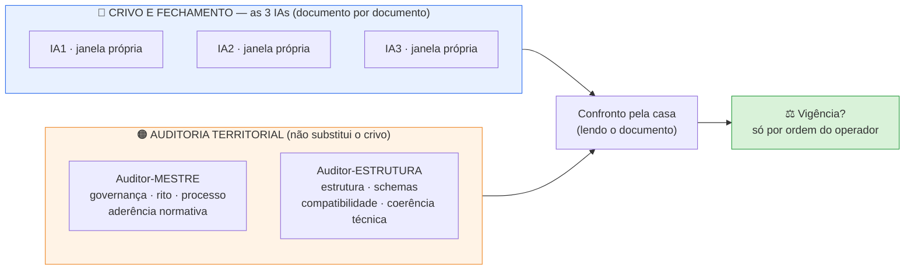

# 📙 CRIVO DOCUMENTAL — LIVRETO 4 de 4

> 🔄 **ATUALIZAÇÃO de 30/09/2026 (noite) — quem faz o quê mudou.** Vale o [`FLUXO_CRIVO_DOCUMENTAL_2026-09-30.md`](FLUXO_CRIVO_DOCUMENTAL_2026-09-30.md) (mesma pasta): 3 agentes Arena → folha da casa → Comentador → auditor do território. Neste livreto **valem** as seções de conteúdo (objeto, medições, pontos de verificação) e o **Prompt A** (com a abertura do fluxo, §4). **Não valem** o desenho de 5 janelas nem os Prompts B e C: use os prompts do fluxo (§6 e §7).

### `6º BLOCO DE ESTADO (v1.8).md` · pacote enxuto · cada um em chat novo

📅 **30/09/2026** · ✏️ Arena (casa) · 🔗 mesmo molde dos Livretos 2 e 3 · 🎨 padrão visual de `2026-09-30_PACOTES_CHAT_NOVOS` · 🏁 **último livreto da série**

---

## 🎯 O que este pacote pede

**Objeto:** declarar (ou não) **VIGENTE**, para uso operacional no piloto oficial `B1.SM02.014`, o **Bloco de Estado — B1 / SM-02 (v1.8)**.
**Régua:** Roteiro §6.1 — `EXISTENTE ≠ VALIDADO ≠ VIGENTE ≠ AUTORIZADO PARA USO`.
**Natureza:** crivo **documental**. **0 ciência** — não se julga conteúdo científico (achados, números de estudos, PMIDs).
**Regra:** divergência se resolve **lendo o documento** — nunca por votação.
**O documento fica intacto:** este pacote é um arquivo **à parte**; nada no Bloco foi alterado para montá-lo.

## 🗺️ Quem faz o quê (orientação do Comentador, repassada pelo operador)



- As **3 IAs** fazem o crivo e o fechamento. Os **2 auditores** não as substituem.
- As **5 janelas são independentes**: ninguém vê o parecer do outro (**0 ciência**).
- **Pacote enxuto:** base comum indispensável + **só o adicional** necessário a cada um.

---

## 1️⃣ O que é este documento (papel na obra)

É o **6º e último item do pacote mínimo obrigatório** do COMO EXECUTAR v1.11 rev.2 — *"sempre por último. É o mais mutável (muda a cada claim fechado) e o que efetivamente diz 'onde paramos, o que fazer agora'"* (linhas 112–114).

> 🔑 **Por que ele é diferente dos outros três livretos:** o IDs, o Protocolo e a Lista são **estáveis**. O Bloco de Estado **muda a cada claim fechado**. Logo, uma vigência declarada vale **para a digital `7db41d40…` (v1.8, 17/09)** — e **só para ela**. Uma versão nova do Bloco será **outro documento** (outra digital), com seu próprio crivo.

| Bloco do arquivo | Em uma frase |
|---|---|
| Cabeçalho (linhas 1–77) | histórico de versões v1.3 → v1.8 e o que mudou em cada uma |
| Cabeçalho de identidade (linhas 79–87) | `modulo`, `natureza_claims`, `destino_final`, `schema_saida`, `submodulo_ativo`, `portoes`, `vocabulario` |
| `regras` (linhas 89–109) | as **8 regras** de conduta da sessão (nunca criar ID de claim, nunca citar PMID de memória, etc.) |
| `claims_aprovados` (linhas 111–917) | as **23 entradas aprovadas** (15 claims + 8 subclaims) com fontes e ressalvas |
| `fontes_rejeitadas` (linhas 918–1042) | log único de exclusão: **92 entradas** |
| `claims_em_andamento` (1043–1072) | os 4 claims em busca (`.017`, `.023`, `.028`, `.032`) |
| `pendencias_decisao_usuario` (1073–1090) | **P1 a P4** — decisões que cabem ao operador |
| `proximo_alvo` (1093–1100) | ordem: `.017`, `.016`, `.018`, `.019`, `.020` |

---

## 2️⃣ Cópias e digitais (medidas hoje, 30/09/2026)

| Peça | 📍 Caminho | 🔢 Digital | Observação |
|---|---|---|---|
| **Objeto (kit vigente)** | `uploads/Atuais/Documentos/6º BLOCO_DE_ESTADO__v1_8.md` | `7db41d40…` | 1.100 linhas · 77.441 bytes · LF · 0 CR · 0 TAB |
| Cópia idêntica | `BIBLIOTECAS/_documentos_serie/KIT_CLINICA_ATUALIZADO_recebido_2026-09-25/6º_BLOCO_DE_ESTADO__v1_8.md` | `7db41d40…` | idêntica |
| ⚠️ Cópia idêntica **em pasta "Antigos"** | `uploads/Antigos/Documentos/6º_BLOCO_DE_ESTADO__v1_8.md` | `7db41d40…` | **mesma digital do vigente**, mas dentro de `Antigos/` — ver ponto B7 |
| 🕰️ Versão anterior (histórica) | `uploads/Antigos/Documentos/6º BLOCO DE ESTADO  v1.6.md` e `KIT_CLINICA_recebido_2026-09-15/…` | `e090e850…` | **v1.6** — substituída, **não entra** |
| ℹ️ **Não é cópia** | `uploads/Atuais/Documentos/ESTRUTURAS DE JSONS VÍNCULOS,PMIDS, BLOCO DE ESTADO.md` | `4ffa2740…` | documento de **modelos de estrutura** (exemplos); as linhas 252–349 mostram a estrutura do Bloco |

- 🟢 **Uma só versão** (v1.8) em todas as cópias — nenhuma variante.
- 🟡 **Não existe bilhete `*_VIGENTE.txt` próprio** para este documento — é justamente o que este crivo decide.
- ⏳ **Dependências registradas (ainda sem veredito):** **Livreto 3** (a Lista Canônica v1.5 e o Bloco se citam mutuamente) e **Livreto 1** (IDs). Se algum veredito alterar um documento, **repetir** a conferência correspondente.

---

## 3️⃣ O que a casa já mediu (conferência mecânica — **não** é o crivo)

| Conferência | Resultado |
|---|---|
| Forma do arquivo | 1.100 linhas · LF · **0 TAB** · **0 CR** (o histórico v1.6 registra TABs e chaves repetidas como defeitos antigos) |
| Chaves de 1º nível | **16 · nenhuma repetida** |
| Entradas em `claims_aprovados` | **23 = 15 principais + 8 subclaims** · **0 IDs duplicados** |
| Cabeçalho × entradas | o cabeçalho declara "23 entradas aprovadas (15 principais + 8 subclaims)" — **bate** |
| Status das 23 | 15 `aprovado_com_ressalva` · 8 `aprovado` — **bate com a Lista Canônica v1.5** (mesmos totais, **0 divergência** entrada a entrada) |
| `aprovado_com_ressalva` × `nota_ressalva` | **15 de 15** têm `nota_ressalva` (exigência do Schema-Claim) |
| Campos por entrada | `verification`, `evidence_role`, `uso`, `statement`, `especificidade`, `usado_em_biblioteca`: **23/23** |
| Valores | `verification`: 23 `verificado_nesta_conversa` · `evidence_role`: 23 `human_clinical` · `uso`: 12 `clinico` · 7 `contexto_mecanistico` · 4 `gap_pesquisa` — todos **dentro** dos vocabulários do Schema-Claim v1.3 rev.3 |
| `claims_em_andamento` × Lista | `.017`, `.023`, `.028`, `.032` — **idênticos** aos 4 `em_busca` da Lista |
| `proximo_alvo` × Lista | `.017, .016, .018, .019, .020` — **idêntico** ao da Lista |
| `referencia_cruzada` | `.007b` → B12 · `.011` → B4 + B5 + `cenario_E99_…` · `.013` → B3 (**idênticas** às da Lista) · `.014` e `.015` → `[]` — **5 IDs citados · 5 presentes** no catálogo |
| `fontes_rejeitadas` | **92** entradas · **0** PMID repetido (o cabeçalho v1.7 declara "92 entradas únicas") |
| Ponta do piloto | `B1.SM02.014`: entrada nas **linhas 849–917** · `status: aprovado_com_ressalva` · `version: 1` |
| Ordem das entradas | `.015` (linha 758) aparece **antes** de `.014` (linha 849) — registro factual |

---

## 4️⃣ 🔎 PONTOS DE VERIFICAÇÃO (para os auditores — **não** são correções prévias)

> Nada abaixo foi corrigido. Cada ponto traz **só o fato medido**; o julgamento é de quem audita.

### 🔎 B1 — `schema_saida` aponta para "Schema-Claim v1.2"
- **Onde:** linha 82 (`schema_saida: "Schema-Claim v1.2 — provisório até decisão do schema de evidencias/bibliografia"`) e linha 117 (`# Formato: Schema-Claim v1.2`).
- **Fato:** o Schema-Claim **vigente** é **v1.3 rev.3** (`e9f9e5d8…`). A mesma frase aparece na Lista Canônica v1.5 (ponto L1) e na Estrutura Mestre v2.2.

### 🔎 B2 — campo `forca_evidencia_afirmacao` (claim `.014`)
- **Onde:** linha 876, em `.014`: `forca_evidencia_afirmacao: media   # campo experimental — oficializar em Schema-Claim v1.3`.
- **Fato:** o campo **não consta** nos campos do Schema-Claim v1.3 rev.3. A pendência **P4** (linhas 1086–1089) registra: *"sem vocabulário fechado definido"*. É o claim do piloto.

### 🔎 B3 — campos do Schema-Claim v1.3 nas 23 entradas
- **Fato:** `version: int` (campo do Schema) aparece em **8 das 23** entradas. `grau_maturidade_cientifica` e `ressalvas` aparecem em **0 das 23**; o Schema descreve `grau_maturidade_cientifica` como vazio/opcional (linhas 201–202).
- *(As entradas seguem o formato declarado v1.2, conforme B1.)*

### 🔎 B4 — pendências que cabem ao operador: P1, P2, P4 abertas
- **Fato:** o cabeçalho diz "**P3 resolvida por uso; P1 e P2 seguem abertas**"; **P4** (campo `forca_evidencia_afirmacao`) também consta aberta. **P1:** o PMID `20132991` consta como fonte de `.012c` **e** em `fontes_rejeitadas` — é o **único** PMID nas duas listas (o cabeçalho v1.7 registra: *"entrada do log escopada ao claim .012; reuso em .012c é permitido"*). **P2** é a mesma `nota_conflito_pendente` do ponto L4 do Livreto 3.

### 🔎 B5 — referências a versões e a arquivos que mudaram de nome
- **Fato:** o Bloco cita "Como Executar v1.7" (linhas 100, 1048) e "v1.8" (linha 7) — o COMO EXECUTAR **vigente** é **v1.11 rev.2** (`1ea6d354…`). Cita `CANDIDATOS_IDS_OFICIAIS.yaml` (linha 95) — no kit o arquivo é `CANDIDATOS_IDS_OFICIAIS — v1.0.md`. *(Mesmo tipo de achado do ponto V2 do Livreto 2.)*

### 🔎 B6 — documento mutável: o que a vigência cobre
- **Fato:** o COMO EXECUTAR diz que o Bloco "**muda a cada claim fechado**" (linhas 112–114), deve ser "**colado sempre no início da sessão**" (linha 162) e que, ao fechar a sessão, *"se algum documento mudou (Bloco de Estado, Lista Canônica), reanexar/atualizar o arquivo"* (linhas 173–175). Os documentos do piloto (corpus congelado e entrega da tríade, 26/09) registram que o piloto **não regrava** o status do `.014`. O Bloco **não contém** regra sobre vigência nem sobre quando uma nova versão exige novo crivo (busca por "crivo", "vigen" e "nova versão": 0 ocorrências), e não há bilhete.

### 🔎 B7 — localização e fontes externas
- **Fato:** existe uma cópia de **mesma digital** do vigente dentro de `uploads/Antigos/Documentos/` (pasta de versões antigas). O campo `nao_escolhidos_arquivo_externo` (linha 1091) cita o arquivo `Estudos que não foram escolhidos.md` — **arquivo que não está no repositório** e não faz parte do pacote.

### 🔎 B8 — nome "JSONS" × formato YAML
- **Fato:** o arquivo `ESTRUTURAS DE JSONS VÍNCULOS,PMIDS, BLOCO DE ESTADO.md` intitula a seção das linhas 252–349 *"MODELO DE ESTRUTURA ATUAL — JSONS DO BLOCO DE ESTADO CLAIM CLÍNICO"*; o conteúdo dessa seção é **YAML**, e as entradas de exemplo (`.001`, `.001b`) têm **o mesmo formato** das do Bloco v1.8.

---

## 5️⃣ As 5 perguntas do §6.1 (para todos)

1. **É o documento correto?** (papel/nome/lugar — item 6 do pacote mínimo)
2. **Está na versão correta?** (v1.8; as cópias são idênticas; a v1.6 é histórica)
3. **Possui vigência?** (não há bilhete próprio)
4. **Foi aprovado pelo rito aplicável?** (histórico do cabeçalho + este crivo)
5. **Não foi substituído por versão posterior?**

E ainda, no território de cada um:
- 🔵 **IAs:** coerência interna (23 entradas, contadores, status) · coerência com a Lista Canônica v1.5 · IDs ↔ catálogo · sem contradição com Schema-Claim v1.3 rev.3 e COMO EXECUTAR v1.11 rev.2 · **B1–B8**.
- 🟠 **Mestre:** rito, governança, cadeia de versões e **o que a vigência de um documento mutável cobre** — **B1, B4, B5, B6, B7** e a ausência de bilhete.
- 🟠 **Estrutura:** estrutura, compatibilidade com o Schema-Claim — **B1, B2, B3, B4 (P4), B8** e a forma do arquivo (YAML, chaves, contadores).

---

## 6️⃣ Pergunta única

> **"Concordam em declarar VIGENTE, para uso operacional no piloto oficial B1.SM02.014, o `6º BLOCO DE ESTADO (v1.8)` (digital `7db41d40…`, 23 entradas aprovadas, 92 fontes rejeitadas)?"**

Resposta: **sim** · **sim, com ressalva(s)** (listar) · **não** (motivo).
*(Os auditores respondem no seu território: **de acordo / de acordo com ressalva / em desacordo**.)*

**Formato (todos):** veredito em **uma linha** · razões · achados **não bloqueantes** · o que conferiu, **com números**. **0 ciência.**

---

## 7️⃣ 📎 O que cada um recebe (pacote enxuto)

### 🟦 BASE COMUM — os 5 (nesta ordem)

| # | Arquivo | 📍 Caminho | 🔢 Digital |
|---|---|---|---|
| 1 | **Roteiro vigente** ✅ | `ROTEIRO DE TRABALHO DA PLATAFORMA.md` (raiz) | `507eaefa…` |
| 2 | **COMO EXECUTAR v1.11 rev.2** | `BIBLIOTECAS/_documentos_serie/COMO_EXECUTAR_v1.11rev2_vigente_2026-09-25/4º COMO EXECUTAR — v1.11 rev.2.md` | `1ea6d354…` |
| 3 | **Schema-Claim v1.3 rev.3** | `BIBLIOTECAS/_documentos_serie/SCHEMA_CLAIM_v1.3_rev3_vigente_2026-09-25/3º SCHEMA-CLAIM — v1.3.md` | `e9f9e5d8…` |
| 4 | **5º Lista Canônica B1/SM-02 v1.5** (o Bloco e a Lista se citam) | `uploads/Atuais/Documentos/5º_LISTA_CANÔNICA___B1__SM-02_V1_5.md` | `20efa89f…` |
| 5 | 🎯 **OBJETO — Bloco de Estado v1.8** | `uploads/Atuais/Documentos/6º BLOCO_DE_ESTADO__v1_8.md` | `7db41d40…` |

> ✅ **Roteiro conferido hoje:** o arquivo da raiz (`507eaefa…`, 37.919 bytes, 1.171 linhas, errata 29/09) é **idêntico** ao que o bilhete `ROTEIRO_PLATAFORMA_VIGENTE.txt` declara vigente. As versões de 26/09 (`5f8b89dc…`), de 27/09 (`2c286ca1…`) e as de `uploads/Antigos/` são **históricas** e **não** entram.

### ➕ ADICIONAL — só o necessário

| Quem | Adicional | 📍 Caminho | 🔢 Digital | Para quê |
|---|---|---|---|---|
| 🔵🟠 **os 5** | `1º IDS_OFICIAIS` | `uploads/Atuais/Documentos/1º IDS_OFICIAIS.md` | `3c0eccac…` | `referencia_cruzada` (5 IDs) |
| 🟠 **Mestre** | Bilhete do Roteiro | `BIBLIOTECAS/_documentos_serie/ROTEIRO_PLATAFORMA_VIGENTE.txt` | — | confirmar vigência do Roteiro |
| 🟠 **Mestre** | Bilhete do COMO EXECUTAR | `BIBLIOTECAS/_documentos_serie/COMO_EXECUTAR_V111_VIGENTE.txt` | — | rito aplicável |
| 🟠 **Estrutura** | **Trecho** de `ESTRUTURAS DE JSONS…` — **só linhas 252–349** | `uploads/Atuais/Documentos/ESTRUTURAS DE JSONS VÍNCULOS,PMIDS, BLOCO DE ESTADO.md` | `4ffa2740…` (arquivo inteiro) | B8 |

### 🚫 Fora (Nível C — não anexar)
Anamnese · bibliotecas de conteúdo · ciência clínica · Protocolo de Escopo · Estrutura Mestre · Filosofia · Decisões Arquiteturais · L06 · Contrato de Saída · schemas N1/N2 · `CANDIDATOS_IDS_OFICIAIS` · `Estudos que não foram escolhidos.md` (não está no repositório).
*(Se algum auditor julgar que precisa de uma dessas peças, **pede**; a casa entrega só aquela.)*

---

## ✉️ PROMPT A — 🔵 IA1 / IA2 / IA3 (o mesmo texto; cada uma em janela própria)

```text
CRIVO DOCUMENTAL — LIVRETO 4 de 4 — SESSÃO NOVA

Você é uma das três IAs (IA1, IA2, IA3) que fazem o crivo e o fechamento, documento
por documento, antes de cada documento ser considerado vigente. Você trabalha em janela
própria, SEM ver o parecer das outras. Divergência se resolve lendo o documento, nunca
por votação. Crivo DOCUMENTAL: 0 ciência (não julgue achados, números de estudos nem PMIDs).

OBJETO: 6º BLOCO DE ESTADO (v1.8) (digital 7db41d40…).
RÉGUA: Roteiro §6.1 — EXISTENTE ≠ VALIDADO ≠ VIGENTE ≠ AUTORIZADO PARA USO.
ATENÇÃO: o Bloco de Estado é o documento que MUDA a cada claim fechado; a vigência que
você avalia vale somente para a digital 7db41d40… (v1.8, 17/09).

ANEXOS (nesta ordem): 1 Roteiro vigente (507eaefa) · 2 COMO EXECUTAR v1.11 rev.2 (1ea6d354)
· 3 Schema-Claim v1.3 rev.3 (e9f9e5d8) · 4 Lista Canônica B1/SM-02 v1.5 (20efa89f) ·
5 OBJETO (7db41d40) · adicional: 1º IDS_OFICIAIS (3c0eccac).

FAÇA: (a) as 5 perguntas do §6.1; (b) confira a coerência interna do objeto (23 entradas =
15 claims + 8 subclaims; status; campos obrigatórios), com números; (c) confira o Bloco
contra a Lista Canônica (status, claims em andamento, próximo alvo); (d) confira os IDs
citados contra o catálogo; (e) confira contradição com o Schema-Claim e o COMO EXECUTAR;
(f) examine os PONTOS DE VERIFICAÇÃO B1–B8 — são pontos a verificar, NÃO correções
prévias: não corrija nada, não reescreva o documento.

PERGUNTA ÚNICA: "Concordam em declarar VIGENTE, para uso operacional no piloto oficial
B1.SM02.014, o 6º BLOCO DE ESTADO (v1.8), digital 7db41d40…?"
RESPOSTA: sim · sim, com ressalva(s) (listar) · não (motivo).

FORMATO: veredito em uma linha · razões · achados não bloqueantes · o que conferiu, com números.
Não execute os scripts de produção. Não invente documento que não recebeu — peça-o.
```

## ✉️ PROMPT B — 🟠 AUDITOR-MESTRE

```text
AUDITOR-MESTRE — SESSÃO NOVA — CRIVO DOCUMENTAL, LIVRETO 4 de 4

Você é o Auditor-Mestre: governança, contratos, rito, processo e aderência normativa.
Sua auditoria NÃO substitui o crivo das três IAs e é independente da auditoria do
Auditor-Estrutura: janela própria, sem ciência do parecer dele. 0 ciência.

OBJETO: 6º BLOCO DE ESTADO (v1.8) (digital 7db41d40…) — documento MUTÁVEL: a vigência
avaliada vale somente para esta digital.
ANEXOS: 1 Roteiro vigente (507eaefa) · 2 COMO EXECUTAR v1.11 rev.2 (1ea6d354) ·
3 Schema-Claim v1.3 rev.3 (e9f9e5d8) · 4 Lista Canônica B1/SM-02 v1.5 (20efa89f) ·
5 OBJETO · adicionais: 1º IDS_OFICIAIS (3c0eccac) · ROTEIRO_PLATAFORMA_VIGENTE.txt ·
COMO_EXECUTAR_V111_VIGENTE.txt.

SEU TERRITÓRIO: o documento tem papel, versão, cadeia de versões, vigência e rito de
aprovação coerentes com o Roteiro §6.1 e com o COMO EXECUTAR? O que a vigência de um
documento que muda a cada claim fechado cobre? Examine B1, B4, B5, B6 e B7 (pontos de
verificação, NÃO correções prévias), as pendências P1–P4 registradas e a ausência de
bilhete de vigência próprio.

RESPOSTA: de acordo · de acordo com ressalva(s) · em desacordo (motivo).
FORMATO: veredito em uma linha · razões · achados não bloqueantes · o que conferiu, com números.
Não corrija o documento. Não invente peça que não recebeu — peça-a.
```

## ✉️ PROMPT C — 🟠 AUDITOR-ESTRUTURA

```text
AUDITOR-ESTRUTURA — SESSÃO NOVA — CRIVO DOCUMENTAL, LIVRETO 4 de 4

Você é o Auditor-Estrutura: estrutura, schemas, compatibilidade, materialização e
coerência técnica. Sua auditoria NÃO substitui o crivo das três IAs e é independente da
auditoria do Auditor-Mestre: janela própria, sem ciência do parecer dele. 0 ciência.

OBJETO: 6º BLOCO DE ESTADO (v1.8) (digital 7db41d40…).
ANEXOS: 1 Roteiro vigente (507eaefa) · 2 COMO EXECUTAR v1.11 rev.2 (1ea6d354) ·
3 Schema-Claim v1.3 rev.3 (e9f9e5d8) · 4 Lista Canônica B1/SM-02 v1.5 (20efa89f) ·
5 OBJETO · adicionais: 1º IDS_OFICIAIS (3c0eccac) · TRECHO de "ESTRUTURAS DE JSONS
VÍNCULOS,PMIDS, BLOCO DE ESTADO" (apenas linhas 252–349).

SEU TERRITÓRIO: a estrutura do objeto é compatível com o Schema-Claim v1.3 rev.3 e com a
Lista Canônica? Os campos e vocabulários fecham? A forma do arquivo é sã (chaves,
contadores, entradas)? Examine B1, B2, B3, B4 (P4) e B8 (pontos de verificação, NÃO
correções prévias).

RESPOSTA: de acordo · de acordo com ressalva(s) · em desacordo (motivo).
FORMATO: veredito em uma linha · razões · achados não bloqueantes · o que conferiu, com números.
Não corrija o documento. Não invente peça que não recebeu — peça-a.
```

---

## 📌 Depois dos vereditos

1. A casa **confronta** as 5 respostas, **lendo o documento** (nunca por votação) e registra o resultado.
2. **Vigência só por ordem do operador.** Este pacote **não declara nada vigente**.
3. Com os 4 livretos julgados, o roteiro avança: **vigência → pacotes finais → Piloto oficial `.014`** (Roteiro §19).

*Nenhuma linha de ciência foi lida, alterada ou julgada para montar este pacote.*
