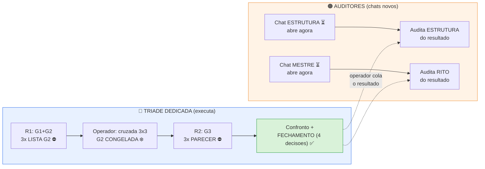

# 🛰️ PACOTES PARA CHATS NOVOS — etapa do piloto .014

### cada auditor em chat novo · economia de créditos · arquivo por arquivo

📅 **30/09/2026** · ✏️ Arena · 🔄 revisa a versão de 26/09 (`ENTREGAS/2026-09-26_PACOTES_CHAT_NOVOS/`) · ✅ digitais vigentes pós-errata 29/09

---

## 🟢 Estado (documentado)

- 🟢 Roteiro vigente: errata 29/09 (`507eaefa`)
- 🟢 Protocolo do piloto: COMO EXECUTAR v1.11 rev.2 (`1ea6d354`)
- 🟢 Corpus congelado 26/09: 107 refs (`20c7159b`), saneado
- 🟢 Ensaio pré-piloto: **encerrado** (não repetir)
- 🟡 Tríade dedicada: pacote entregue 26/09; **Rodada 1 começa sob comando do operador** (Roteiro §20: piloto PENDENTE — confirmar antes de abrir os chats)
- 🟢 Claim `.014` = `aprovado_com_ressalva` — o piloto **NÃO** regrava o status

## 🗺️ O mapa — quem faz o quê, quando



---

## 🟠 CHAT A — AUDITOR-ESTRUTURA

**Papel:** estrutura · schemas · materialização · N1/N2

### 📎 Anexar/colar (nesta ordem — Modo B)

| # | Arquivo | 📍 Caminho | 🔢 Digital |
|---|---|---|---|
| 1 | **Roteiro vigente** | `ROTEIRO DE TRABALHO DA PLATAFORMA.md` (raiz) | `507eaefa…` |
| 2 | **COMO EXECUTAR v1.11 rev.2** (protocolo do piloto) | `BIBLIOTECAS/_documentos_serie/COMO_EXECUTAR_v1.11rev2_vigente_2026-09-25/4º COMO EXECUTAR — v1.11 rev.2.md` | `1ea6d354…` |
| 3 | **Corpus congelado** | `ENTREGAS/2026-09-26_PILOTO_014/CORPUS_CONGELADO_PILOTO_B1SM02014_2026-09-26.md` | `20c7159b…` |
| 4 | **Regras da tríade** | `ENTREGAS/2026-09-26_PILOTO_014/ENTREGA_TRIDE_PILOTO_014_2026-09-26.md` | `b1c6cde3…` |
| 5 | **Meta do corpus** | `ENTREGAS/2026-09-26_PILOTO_014/META_CORPUS_CONGELADO_2026-09-26.json` | `dc78c5e5…` |
| 6 | 🆕 **Schema-Claim v1.3** (formato do fechamento) | `BIBLIOTECAS/_documentos_serie/SCHEMA_CLAIM_v1.3_rev3_vigente_2026-09-25/3º SCHEMA-CLAIM — v1.3.md` | `e9f9e5d8…` |
| 7 | **Contrato de Saída rev.2** | `BIBLIOTECAS/_documentos_serie/CONTRATO_SAIDA_CLAIMKIT_rev2_vigente_2026-09-24/CONTRATO_SAIDA_CLAIMKIT_rev2_2026-09-24.md` | `03cdd19a…` |
| 8 | **N2 v1.4 + N1 v1.3** (só checagens estruturais) | `BIBLIOTECAS/_documentos_serie/AUDITOR2_L05_N1v13_N2v14_COMENTADOR_recebido_2026-09-18/schema_vinculo_v1.4_N2_d96ad15b.json` · `…/schema_referencia_v1.3_N1_b06660fd.json` | `d96ad15b…` · `b06660fd…` |
| 9 | **Ponteiros VIGENTE** (3 txt, atualizados 29/09) | `BIBLIOTECAS/_documentos_serie/` → `CONTRATO_SAIDA_CLAIMKIT_VIGENTE.txt` · `SCHEMA_CLAIM_V1_3_VIGENTE.txt` · `COMO_EXECUTAR_V111_VIGENTE.txt` | — |

**Colar no início da sessão (por último):** `uploads/Atuais/Documentos/6º BLOCO_DE_ESTADO__v1_8.md` (`7db41d40…`)

### ✉️ PROMPT DE ABERTURA A — copiar e colar

```text
AUDITOR-ESTRUTURA — SESSÃO NOVA — ETAPA DO PILOTO B1.SM02.014

Você é o Auditor-Estrutura (estrutura, schemas, materialização, N1/N2).
Esta é uma sessão NOVA; o histórico está nos arquivos anexados.

ESTADO ATUAL:
- Roteiro da plataforma vigente (errata 29/09, 507eaefa) — anexado
- COMO EXECUTAR v1.11 rev.2 é o protocolo DO PILOTO (1ea6d354; 2 paradas; G1+G2 contínuos)
- Corpus do piloto CONGELADO: 107 refs (sha 20c7159b), saneado, marcado
- Ensaio pré-piloto já ENCERRADO (não repetir)
- Tríade dedicada executa a Rodada 1 sob comando do operador (entrega LISTA G2 e pára)
- Claim B1.SM02.014 = aprovado_com_ressalva — o piloto NÃO regrava o status

SEU PAPEL: auditar o RESULTADO (G3 e fechamento), NÃO a Lista G2.
O cruzamento do G2 é da própria tríade (auditoria cruzada 3×3 no v1.11).
Você audita DEPOIS, quando o operador trouxer o resultado:

- Integridade: tabela G3 × corpus congelado (contagem = parágrafo-DOI, 107 base;
  marcas [FORA_LOTE_TSPO] etc. preservadas)
- Formato das entregas: paradas respeitadas; níveis de leitura
  (texto_completo|abstract|nao_lido) coerentes; 4 decisões no formato do
  Schema-Claim v1.3 (anexado)
- Checagens estruturais contra N1 v1.3 / N2 v1.4 selados (anexados), quando couber
- Achados: operacional × normativo (nada normativo muda sem ciclo)
- NÃO executar G1/G2/G3; NÃO classificar fontes; NÃO fechar claim

Quando o operador trouxer o RESULTADO (G3/fechamento) da tríade, você audita
a estrutura dele e devolve o registro. Esperar comando.
```

---

## 🔵 CHAT B — AUDITOR-MESTRE

**Papel:** contrato · governança · processo · execução do protocolo · aderência ao rito

### 📎 Anexar/colar (nesta ordem — Modo B)

| # | Arquivo | 📍 Caminho | 🔢 Digital |
|---|---|---|---|
| 1 | **Roteiro vigente** | `ROTEIRO DE TRABALHO DA PLATAFORMA.md` (raiz) | `507eaefa…` |
| 2 | **COMO EXECUTAR v1.11 rev.2** | `BIBLIOTECAS/_documentos_serie/COMO_EXECUTAR_v1.11rev2_vigente_2026-09-25/4º COMO EXECUTAR — v1.11 rev.2.md` | `1ea6d354…` |
| 3 | **Corpus congelado** | `ENTREGAS/2026-09-26_PILOTO_014/CORPUS_CONGELADO_PILOTO_B1SM02014_2026-09-26.md` | `20c7159b…` |
| 4 | **Regras da tríade** | `ENTREGAS/2026-09-26_PILOTO_014/ENTREGA_TRIDE_PILOTO_014_2026-09-26.md` | `b1c6cde3…` |
| 5 | **Meta do corpus** | `ENTREGAS/2026-09-26_PILOTO_014/META_CORPUS_CONGELADO_2026-09-26.json` | `dc78c5e5…` |
| 6 | **Schema-Claim v1.3** (fechamento) | `BIBLIOTECAS/_documentos_serie/SCHEMA_CLAIM_v1.3_rev3_vigente_2026-09-25/3º SCHEMA-CLAIM — v1.3.md` | `e9f9e5d8…` |
| 7 | **Contrato de Saída rev.2** | `BIBLIOTECAS/_documentos_serie/CONTRATO_SAIDA_CLAIMKIT_rev2_vigente_2026-09-24/CONTRATO_SAIDA_CLAIMKIT_rev2_2026-09-24.md` | `03cdd19a…` |
| 8 | **Schema-Claim Mecanismo v3.1** (vocabulário `sentido_do_achado`) | `Ferramentas de geração e auditoria/02_fase1_gpm_profundidade/3º SCHEMA-CLAIM — MECANISMO v3.1.md` | — |
| 9 | **Ponteiros VIGENTE** (3 txt, atualizados 29/09) | `BIBLIOTECAS/_documentos_serie/` → `CONTRATO_SAIDA_CLAIMKIT_VIGENTE.txt` · `SCHEMA_CLAIM_V1_3_VIGENTE.txt` · `COMO_EXECUTAR_V111_VIGENTE.txt` | — |

**Colar no início da sessão (por último):** `uploads/Atuais/Documentos/6º BLOCO_DE_ESTADO__v1_8.md` (`7db41d40…`)

### ✉️ PROMPT DE ABERTURA B — copiar e colar

```text
AUDITOR-MESTRE — SESSÃO NOVA — ETAPA DO PILOTO B1.SM02.014

Você é o Auditor-Mestre (contrato, governança, processo, execução do
protocolo, aderência ao rito). Sessão NOVA; histórico nos arquivos anexados.

ESTADO ATUAL:
- Roteiro vigente (errata 29/09, 507eaefa) — anexado
- Protocolo DO PILOTO = COMO EXECUTAR v1.11 rev.2 (1ea6d354; duas paradas;
  G1+G2 contínuos; nao_lido ≠ analisado; fechamento conjunto com 4 decisões)
- Corpus CONGELADO do piloto: 107 refs (20c7159b), saneado
- Ensaio pré-piloto ENCERRADO — não repetir
- Tríade dedicada (ChatGPT / Arena / Claude dedicados) executa a Rodada 1
  sob comando do operador
- Claim .014 = aprovado_com_ressalva — piloto NÃO regrava

SEU PAPEL: auditar o RESULTADO (G3 e fechamento), NÃO a Lista G2.
O cruzamento do G2 é da própria tríade (auditoria cruzada 3×3 no v1.11).
Você audita DEPOIS, quando o operador trouxer o resultado:

- ADERÊNCIA AO RITO do que foi executado: respeitou as 2 paradas?
  registro de leitura (texto_completo|abstract|nao_lido) coerente?
  divergência factual foi à fonte primária (nunca votação)?
- Fechamento: as 4 decisões do Schema-Claim v1.3 preenchidas
  (estado · direção por fonte · tipo de ressalva · moderadores)
  e C-5 preservado (ressalva não some)
- Achados: operacional × normativo (nada normativo muda sem ciclo)

Quando o operador trouxer o RESULTADO (G3/fechamento) da tríade, você audita
aderência ao rito e devolve o registro. Esperar comando.
```

---

## ✅ Checklist — antes de abrir os chats

- [ ] 🟡 **Confirmar com o operador:** a tríade já está na Rodada 1? (Roteiro §20 diz PENDENTE)
- [ ] 🟢 Roteiro `507eaefa` · manual `1ea6d354` · schema `e9f9e5d8` · contrato `03cdd19a`
- [ ] 🟢 Corpus `20c7159b` (107 refs) · Bloco v1.8 `7db41d40` (colar **fresco**, por último)
- [ ] 🟢 N1 `b06660fd` · N2 `d96ad15b` (só no chat A)
- [ ] 🔴 Não colar versão velha de nada · não pular a ordem · auditor não executa G1/G2/G3

## 🕘 Ordem de uso

1. 🟠🔵 Operador abre **Chat Estrutura** (prompt A) e **Chat Mestre** (prompt B) — um cada
2. 🔵 Tríade dedicada roda a **Rodada 1** (LISTA G2) ⛔
3. 🔵 R1 entregue → operador faz a cruzada → ❄️ LISTA G2 CONGELADA → R2 (G3) ⛔ → confronto → ✅ fechamento
4. 🟠🔵 **DEPOIS** do resultado pronto: colar nos 2 chats → Estrutura audita a **estrutura** · Mestre audita o **rito**

**Nada aqui reabre base nem refaz ensaio.** 0 ciência.

---

## 📝 O que mudou vs 26/09

- 🆕 **Schema-Claim v1.3 incluído no pacote A** (era falha: o Estrutura confere "4 decisões no formato" sem ter o formato)
- 🟡 **Estado corrigido:** "piloto na Rodada 1" (dado como fato) → Rodada 1 sob comando, a confirmar (Roteiro: PENDENTE)
- 🔢 **Digitais atualizadas** pós-errata 29/09 (roteiro `507eaefa` · manual `1ea6d354` · schema `e9f9e5d8` · contrato `03cdd19a`)
- 📍 **Caminhos corrigidos** (`/home/user/…` removido) · ✏️ "tréade" → "tríade"

## 📖 Legenda dos sinais

🟢 pronto / vigente · 🟡 atenção — confirme com o operador · 🔴 proibido · ⛔ parada obrigatória · ⏳ aguarda comando · ❄️ congelado · 🆕 novo nesta versão · 📎 anexar · 📍 caminho · 🔢 digital · ✉️ prompt pronto para colar

*Arena · 30/09/2026 · 0 ciência.*
